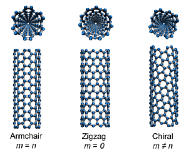

The following guide documents a number of VMD-specific tasks which I had to perform in relation to my research work on graphene at the University of Malta.

### Creation of a structure file for regular graphene

1.  Extensions < Modeling < Nanotube Builder
2.  Set the desired values in Graphene Sheet Building Options e.g. `10,10,1` for a graphene monolayer of size 10 nm by 10 nm
3.  Save coordinates... > Set file type as XYZ

### Creation of a structure file for multi-layered graphene with defects

1. Pass an `.xyz` file as input to the defect-generating Python script to generate graphene sheets with varying levels of single-vacancy defects, in separate files
2. Modify the z-axis values of each file using a text editor
3. Merge the atom coordinates into a single file:
```bash
cat file1.xyz file2.xyz file3.xyz >> combined.xyz
```

### Creation of a structure file for folded graphene

For this task, one has to consider the [chirality and symmetry of the carbon nanotube](http://www.photon.t.u-tokyo.ac.jp/~maruyama/kataura/chirality.html), since folded graphene is conceptually regular graphene stitched to half a CNT. 
```tcl
nanotube -l 0.3 -n 0 -m 4 -cc 0.1418 -ma C-C  
graphene -lx 0.368 -ly 0.1228 -type zigzag -cc 0.1418 -ma C-C 
set sheet [atomselect all]  
measure minmax $sheet $sheet moveby {1 0 0} $sheet move [transaxis y -90]
```

For reference, these are the atomic distances of the two forms of regular graphene:
$$
\begin{array}{c|c}
\textnormal{Zig-zag}& \textnormal{Armchair} \\
\hline
\textnormal{$0.1228(2n−1)$}& 
\begin{array}{l}  \rule{0pt}{3ex}
\textnormal{$0.4254 \times {(n-2)}/2 + 0.2836$}\\
\end{array} \\
\end{array}
$$
where *n* represents the number of 4-carbon fragments

### Creation of a LAMMPS data file

1. Load a structure file in `xyz` format.
2. From within the Tcl console, run:
```tcl
[atomselect top "all"] set type C
topo writelammpsdata /path/to/file.data atomic
```
Note that in this example, the data file was intentially generated without any bond information in order not to cause any problems for the AEREBO potential which, during the LAMMPS simulation, simulated the bond interactions of the system.

### Visualisation of a LAMMPS simulation output

1.  Include the `write_data` command in the LAMMPS input script
2.  Run the LAMMPS simulation
3.  From within the Tcl console, switch to the output directory and specify any one of the `.data` files: 
    ```tcl
	cd /path/to/working/dir
	topo readlammpsdata <output>.data molecular
	```
    VMD will now load any `.data` files in the directory specified.
4.  To show the simulation box, run: 
    ```tcl
	pbc box
	```
5.  Set the number of images to show and check the relevant axes by selecting Graphic > Representations > Periodic tab...

In my opinion, Ovito provides a superior environment for this kind of analysis, especially when it's desirable to export the visualisation in GIF or video format.