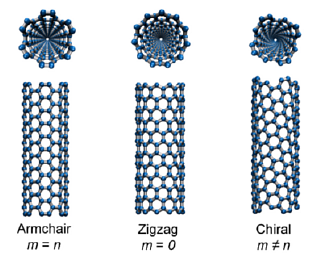

The following note describes a number of VMD-related tasks which are quite useful for conducting graphene computational research using LAMMPS.

## Creation of a structure file for regular graphene

1.  Open VMD and choose *Extensions* < *Modeling* < *Nanotube Builder*.
2.  Set the desired values in *Graphene Sheet Building Options*, for instance,`10,10,1` to create a graphene monolayer of size 10 nm by 10 nm.
3.  Select *Save coordinates...* > *Set file type as XYZ*.

## Creation of a structure file for multi-layered graphene with defects

1. Use the trajectory file generated in the previous task to serve as input to a custom Python script which should produce several other trajectory files corresponding to graphene sheets with varying levels of topological defects.
2. In a text editor, modify the z-axis values of each file to some preferred value.
3. Merge the atom coordinates into a single file:
```bash
cat file1.xyz file2.xyz file3.xyz >> combined.xyz
```

## Creation of a structure file for folded graphene

For this task, one must consider the [chirality and symmetry of the carbon nanotube](http://www.photon.t.u-tokyo.ac.jp/~maruyama/kataura/chirality.html), since folded graphene is conceptually regular graphene stitched to half a CNT. Run the following commands from within the Tcl console of VMD:
```tcl
nanotube -l 0.3 -n 0 -m 4 -cc 0.1418 -ma C-C  
graphene -lx 0.368 -ly 0.1228 -type zigzag -cc 0.1418 -ma C-C 
set sheet [atomselect all]  
measure minmax $sheet $sheet moveby {1 0 0} $sheet move [transaxis y -90]
```

For reference purposes, these are the atomic distances of the two forms of regular graphene:
$$
\begin{array}{c|c}
\textnormal{Zig-zag}& \textnormal{Armchair} \\
\hline
\textnormal{$0.1228(2n−1)$}& 
\begin{array}{l}  \rule{0pt}{3ex}
\textnormal{$0.4254 \times {(n-2)}/2 + 0.2836$}\\
\end{array} \\
\end{array}
$$
where *n* represents the number of 4-carbon fragments

## Creation of a LAMMPS data file

1. Load a trajectory file in VMD.
2. From within the Tcl console, run:
```tcl
[atomselect top "all"] set type C
topo writelammpsdata /path/to/file.data atomic
```
Setting the `atomic` flag ensures that any bond information is excluded from the generated data file so as not to interfere with the bond interactions which would be dynamically created by the AEREBO potential during a LAMMPS simulation. This, however, may be undesirable if a different potential were to be used, hence it is advisable to consult the LAMMPS manual beforehand to ascertain that manual bond assignment is actually not required.

## Visualisation of a LAMMPS simulation output

1.  From within the Tcl console, load the `.data` file generated in the previous task: 
    ```tcl
    cd /path/to/working/dir
    topo readlammpsdata <output>.data molecular
    ```
2.  To display the simulation box, run: 
    ```tcl
	pbc box
	```
3.  Set the number of images to show and check the relevant axes by choosing *Graphic* > *Representations* > *Periodic tab...*

:::note
Ovito arguably provides a superior environment for this kind of qualitative analysis, especially when it's desirable to export the visualisation in GIF or video format.
:::