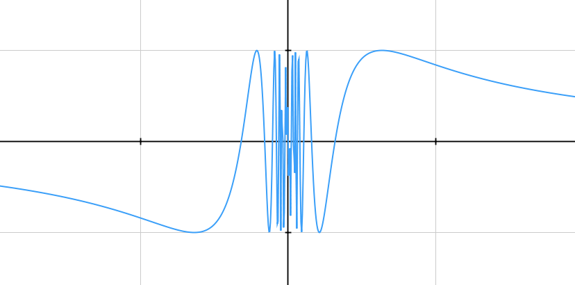
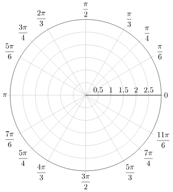
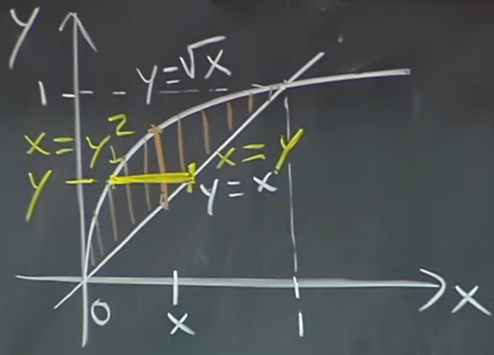
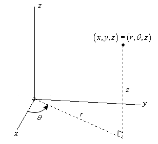
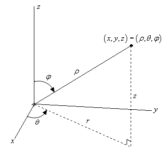

*These notes are based on a series of MIT lectures by Prof. David Jerison on [single variable calculus](https://www.youtube.com/playlist?list=PL221E2BBF13BECF6C), another by Prof. Denis Auroux on [multivariable calculus](https://www.youtube.com/playlist?list=PL4C4C8A7D06566F38), as well as an [introductory series to calculus](https://www.youtube.com/playlist?list=PLtj8-EuXMSIiYGtNkLoF-SQuaY_R2f4wz) by Prof. Gilbert Strang. Further reading is warranted on [differential equations](https://www.youtube.com/playlist?list=PLEC88901EBADDD980), leading to PDE [I](https://ocw.mit.edu/courses/18-152-introduction-to-partial-differential-equations-fall-2011/pages/lecture-notes/) and [II](https://ocw.mit.edu/courses/18-306-advanced-partial-differential-equations-with-applications-fall-2009/). See [here](https://www.youtube.com/playlist?list=PLUl4u3cNGP61O7HkcF7UImpM0cR_L2gSw) for a focus on rigorous proofs, including a series on [metric spaces](https://www.youtube.com/playlist?list=PLUl4u3cNGP613ULTyHAqz04niYf722x7S), which can help bridge the gap between real and functional analysis.*

## Lecture 00

### Definition of derivative

geometric interpretation of derivative starts off with finding tangent line to $y=f(x)$ at $P=(x_0,y_0)$:
$$
y-y_0=m(x-x_0)
$$
derivative of $f$ at $x_0$, $f'(x_0)=m$, defined as slope of tangent line to $y=f(x)$ at $P$

:::note
derivative leads to local linearisation of a non-linear function: a tangent line for a single variable, planes and hyperplanes for several variables - for $f(x)=x^2$, its linearisation at $x=3$ becomes:
$$
f(x)-f(3)=2(3)\cdot (x-3)\\
f(x)=6x-9
$$
and the further $x$ is from localisation, the less accurate $f(x)$ is with respect to real value - derivative is thus a **linear operator** - similarly, integration is a linear operation

important to clarify what is meant exactly by *linear* in linear algebra - in the following example:
$$
Ov = 2v+1
$$
$O$ not a linear operator, despite curve appearing as linear (referred to as *affine* instead), since doubling input $v$ does not double output
:::

### Finite-difference approximations

a consequence of **binomial theorem**, which states that:
$$
(x+\Delta x)^n =x^n+n(x^{n-1}\Delta x)+O((\Delta x)^2) \quad n=0,1,2, ...
$$
where $O((\Delta x)^2)$ represent higher order terms of $\Delta x$, is that as $\Delta x \rarr 0$:
$$
\frac{\delta}{\delta x} x^n=\frac{\cancel{x^n}+n(x^{n-1}\cancel{\Delta x})+O((\Delta x)^{\cancel{2}})-\cancel{x^n}}{\cancel{\Delta x}}=nx^{n-1}

$$
but if $n=1$:
$$
f(x+\delta x) =f(x)+f'(x)\delta x+o(\delta x)\\
$$
where $o(\delta x)$ denotes functions which decay to zero faster than $\delta x$:
$$
\lim_{\delta x \rarr 0} \frac{||o(\delta x)||}{||\delta x||} = 0
$$
showing that the definition of a derivative implicitly requires having a vector space that allows the computation of vector length, which is available to Hilbert spaces being a stricter subset of Banach spaces

to avoid denoting:
$$
 \delta f = f(x+\delta x) -f(x)\approx f'(x)\delta x
$$
switch to differential notation i.e. $df=f'(x)dx$,  where $dx$ treated as arbitrarily small

approximation, known as (forward) finite-difference approximation, is the usual way to check whether derivative is correct given knowledge of $f$ - difference between finite difference and derivative operator should be orders of magnitude smaller, but to be more quantitative, **relative error** computed:
$$
\textnormal{relative error} = \frac{||\textnormal{approx - exact}||}{||\textnormal{exact}||} = \frac{f(x+\delta x) -f(x) - f'(x)\delta x||}{||f'(x)\delta x||}
$$
which essentially computes size of truncated higher-order terms of Taylor expansion relative to first-order term, producing a result proportional to $\delta x$ i.e. linear in $\delta x$ - plotting log value of it against log $\delta x$ reveals, as expected, that error falls as perturbation size lowered, but up to a certain point, due to floating point rounding errors which cause error to increase instead - a general heuristic to find perturbation step size $h$ is by minimising total error, represented as sum of truncation error and floating-point error:
$$
\min \left[ O(h^p) + O(\frac{\delta}{h^k}) \right] \quad \rArr \quad h^p+\frac{\delta}{h^k}=0 \quad \rArr \quad h=\sqrt[p+k]{\delta}
$$
where $p$ order of approximation method, describing accuracy of numerical method itself, regardless of machine precision (1 for forward, 2 for central differences), $\delta$ floating point machine constant, and $k$ is order of derivative being approximated

number of significant digits stored by computer per operation known as **machine epsilon**, $\epsilon$ - once exceeded, the rest rounded off - thus, if $\delta x$ too small, finite difference may get rounded off to zero

:::note
finite difference approximation replaces limit in derivative definition with a finite $\delta x$, introducing an error, called **truncation error**, as it prevents limit from being fully realized - it is this approximation, the linear terms of binomial expansion, that is being compared against the exact derivative
:::

when $x$ a vector, each finite difference only returns one component of gradient, matching a column of Jacobian - although finite differences still useful since computing a few random directions is enough as a derivative check, for things like optimisation which require derivative in all directions to be computed, this becomes impractical, so derivative must be obtained analytically i.e. explicitly using rules of calculus, not approximations, computed efficiently using reverse-mode AD

a less useful aspect of this approximation is to compute $f(x)$ when doing so manually is more complicated, by considering $x$ to be at some forward distance away from $h$ for a common function $f$:
$$
f'(h)(x-h) \approx f(x) -f(h) \quad \rArr \quad f(x) \approx f'(h)(x-h) + f(h)
$$
for $f(x=0.01) = \exp{0.01}$, by setting $h=0$, approximation yields $1 + 1(0.01)=1.01$ - notice how such linear approximation excludes higher order corrections of power series for $e^x$, keeping only constant and linear terms - similarly, for approximation of time dilation equation:
$$
T'=\frac{T}{\sqrt{1-\frac{v^2}{c^2}}}
$$
better expressed as:
$$
f(x)=\frac{1}{\sqrt{1+x}} \qquad \textnormal{where}\;\;x=-\frac{v^2}{c^2}
$$
setting $h=0$ produces **binomial expansion** limited to linear terms:
$$
f(x) \approx1-\frac{1}{2}x
$$
$\therefore T' \approx T(1+\frac{1}{2}\frac{v^2}{c^2})$

simpler relationship valid whenever errors are negligible for the particular problem at hand:
$$
\frac{\Delta T}{T}=\frac{1}{2}\frac{v^2}{c^2} \qquad\textnormal{where}\,\,\,\, \Delta T = T'-T
$$
when linear approximation insufficient, quadratic approximations used, like log quadratic instead of log linear functions in economics

:::note
for linear approximation of $f(x)=(1+x)^r$, re-expressed in terms of $h$:
$$
f(h)=(1+h)^r\\
f'(h)=r(1+h)^{r-1}
$$
at $h=0$,
$$
f(x) \approx 1+rx
$$
similarly, for $f(x)=\ln(1+x)$:
$$
f(h)=\ln(1+h)\\
f'(h)=\frac{1}{1+h}
$$
at $h=0$,
$$
f(x) \approx x
$$
:::

to calculate area under tangent line of $f(x)=\frac{1}{x}$ at $P$, enclosed by axes, necessary to find both x-intercept i.e. $x$ at $x=0$, and y-intercept i.e. $y$ at $x=0$:
{width=50%}
which can be done by first finding $f'(x)$ via tangent line equation:
$$
m=\frac{y-y_0}{x-x_0}=\frac{f(x+\Delta x)-f(x_0)}{\cancel{x}+\Delta x-\cancel{x_0}}=\frac{\frac{1}{x_0+\Delta x}-\frac{1}{x_0}}{\Delta x}=\frac{\cancel{x_0}-(\cancel{x_0}+\cancel{\Delta x})}{\cancel{\Delta x}(x_0(x_0+\Delta x))} = -\frac{1}{x_0^2+\Delta x}
$$
so, in the limit $x \rarr 0$,
$$
f'(x_0)=-\frac{1}{x_0^2}
$$
now, using the same equation but with $x,y$ values on tangent line:
$$
m=\frac{y-y_0}{x-x_0} \quad \rArr \quad  y-y_0=m(x-x_0)

$$
at $y=0$,
$$
0-\frac{1}{x_0}=-\frac{1}{x_0^2}(x-x_0)\\
x=2x_0
$$
at $x=0$:
$$
y-\frac{1}{x_0}=-\frac{1}{x_0^2}\left(0-x_0\right)\\
y=2\frac{1}{x_0}
$$
therefore, area equal to $\frac{1}{2}(2x_0)(2\frac{1}{x_0})= 2$

:::caution
it may be confusing to see role of a letter in a computation change midway, but this done for convenience to avoid need for defining an extra variable
:::

in terms of rate of change, while $\frac{\Delta y}{\Delta x}$ represents average change, its limiting value $\frac{\delta y}{\delta x}$ is the instantaneous rate - differential calculus relies on notion of an infinitesimal change, $\delta x$ to obtain slope at any point along the curve

for distance travelled, $d(t)$ its derivative represents instantaneous speed at time $t$:
$$
\delta y=f'(x)\delta x \quad \rArr \quad \delta d = s(t)\delta t  \\
s(t)=\frac{\delta d}{\delta t}
$$
as opposed to average speed which only returns same outcome when speed is constant:
$$
s(t)= \Delta d/ \Delta t
$$
:::note
$y(x)$ explicitly denotes $y$ as function of $x$, allowing use of derivative notation shorthand, $y'(x)$ i.e. Lagrange's notation, in favour of Leibniz's notation, $\frac{\delta y}{\delta x}$ or $\frac{\delta }{\delta x}y$ which aptly represents an "operator" applied to a function - both notations valid, provided they explicitly show differentiation with respect to $x$
:::

contrast this with integral calculus where, to recover $d(t)$ for time interval $[0,n]$ given $s(t)$, necessary to imagine chopping up interval into infinitesimally small intervals to recover *constant* speed within each interval which, when multiplied by interval size reveals distance travelled, to then sum them up for all intervals:
$$
d(t)=\lim_{\Delta t \rarr 0} \sum_{i=1}^n\left(\frac{\Delta d_i}{\Delta t_i}\right)\Delta t_i = \int \frac{\delta d}{\delta t}\delta t = \int s(t) \delta t
$$
where $s(t_i)\Delta t$ is **Riemann sum**

by the same logic, finding volume of a three-dimensional object:
$$
V = \int A(x) \delta x
$$
specifically, for solids of revolution, made by rotating a two-dimensional shape, say curve of $f(x)=\sqrt{x}$, around an axis of rotation, say x-axis, volume calculated by defining integrand as a slice of a disk of radius $f(x)$, thereby having an area $\pi f^2(x)$:
$$
V=\pi\int_0^1 x\delta x=\frac{\pi}{2}
$$
this works because each disk assumed to have infinitesimal height, and disk radius is a function expressed in terms of height - review [example problem](https://www.youtube.com/watch?v=Lbg1M0PTy1A) and [this one](https://youtu.be/ShGBRUx2ub8?list=PL590CCC2BC5AF3BC1&t=591) to find volume of a sphere

:::note
a different solid of revolution will be obtained when rotating curve around some other axis (see [here](https://youtu.be/ShGBRUx2ub8?list=PL590CCC2BC5AF3BC1&t=1270) for method of shells)
:::

$$
\begin{aligned}
&\qquad \qquad \qquad \qquad\textbf{Integral} & \quad\textbf{Function} &\quad \qquad \quad\textbf{Derivative}\\
& G(x)=\int y'(x)\delta x=\frac{1}{n+1}x^{n+1} +c;\quad n\neq-1&   y=x^n &  \qquad \frac{\delta y}{\delta x}=nx^{n-1};\quad n\neq0 \\
\end{aligned}

$$
note that integral of $g(x)=y'(x) $ termed **indefinite** since there is ambiguity i.e. not a single answer when integrating - any constant $c$ may be added and $G(x)$ would still be antiderivative of $g(x)$ - by contrast, **definite integral** has limits, interpreted geometrically as area under curve, positive above x-axis, negative below:
$$
\int_0^{2\pi}\sin x \delta x=-\cos 2\pi-(-\cos0)=0
$$
therefore, absolute values must be considered for total distance travelled in a round trip

### Product rule

product rule finds derivatives of products of two or more functions, stating that for $p(x)=f(x)g(x)$:
$$
\frac{\delta p}{\delta x}=f(x)\frac{\delta g}{\delta x}+g(x)\frac{\delta f}{\delta x}
$$
thus, given $p(x)=x^3$  $\textnormal{i.e.}\enspace f=x^2, g=x$:
$$
p'(x)=x^2(1)+x(2x)=3x^2
$$
product rule still valid for both vectors and matrices, better represented as:
$$
d(AB) = A(dB) + (dA)B
$$
matrix multiplication is non-commutative, so order of $A$ and $B$ in all terms must be the same - however, vector dot product is commutative, producing same scalar either way:
$$
d(x^T x) = x^T(dx) + (dx^T)x = (2x^T)dx
$$

:::note
derivation of product rule comes for chain rule expressed for multivariate function:
$$
f=uv\quad u=u(t); v=v(t)\\
\frac{\delta(uv)}{\delta t} = f_u\frac{\delta u}{\delta t} + f_v\frac{\delta v}{\delta t}=vu'(t) + uv'(t)
$$
alternative definition using differentials:
$$
\begin{aligned}
df&=g(x+dx)h(x+dx)-g(x)h(x)\\
&=\left[g(x)+g'(x)dx\right]\left[h(x)+h'(x)dx\right] - g(x)h(x)\\
&=g(x)h'(x)dx + g'(x)dxh(x)\\
&=g(x)dh + dgh(x)
\end{aligned}
$$
for $f(x)=A^2$,
$$
df = (A+dA)^2-A^2 = A\;dA +dA\;A + \textcolor{lightgrey}{(dA)^2}
$$
showing how a little perturbation can be expressed in linear form
:::

the reverse requires **method of substitution**:
$$
g(x) = \int x^3(x^4+2)^5 \delta x
$$
if $f(u)=x^4+2$, then $\delta u = 4x^3\delta x$, allowing integral to be redefined in terms of $u$:
$$
\int u^5\cdot\frac{1}{4}\delta u = \frac{1}{24}u^6
$$
$\therefore g(x) = \frac{(x^4+2)^6}{24}+c$

for definite integral, important to update limits in terms of $u$ as well (or use indefinite integral):
$$
g(x) = \int_{x_1=1}^{x_2=2} x^3(x^4+2)^5 \delta x\\
u_1=u(x_1)=1^4+2=3\\
u_2=u(x_2)=2^4+2=18
$$
$$
\begin{aligned}
\therefore g(x)&= \int_3^{18}\frac{u^5}{4}\delta u=\frac{u^6}{24} \Big|_3^{18}\\
&=\frac{18^6}{24}-\frac{3^6}{24}
\end{aligned}
$$
be wary when $u'$ changes sign

in the case of finding derivative of $q(x)=\frac{f(x)}{g(x)}$, **quotient rule** used, which may be derived from product rule:
$$
\begin{aligned}
f(x)&=q(x)g(x)\\
\frac{\delta f}{\delta x}&=q(x)\frac{\delta g}{\delta x}+g(x)\frac{\delta q}{\delta x}\\
&=\frac{f(x)}{g(x)}\frac{\delta g}{\delta x}+g(x)\frac{\delta q}{\delta x}\\
\frac{\delta q}{\delta x}&=\frac{g(x)\frac{\delta f}{\delta x}-f(x)\frac{\delta g}{\delta x}}{g(x)^2}
\end{aligned}
$$
thus, given $q(x)=\frac{1}{x}$, $\enspace q'=-\frac{1}{x^2}$

:::note
derivation of quotient rule follows same pattern as product rule:
$$
f=\frac{u}{v}\quad u=u(t); v=v(t)\\
\frac{\delta(\frac{u}{v})}{\delta t} = f_u\frac{\delta u}{\delta t} + f_v\frac{\delta v}{\delta t}=
\frac{1}{v}u'(t) - \frac{u}{v^2}v'(t)=
\frac{vu'(t)-uv'(t)}{v^2}
$$
:::

### Chain rule

chain rule useful to differentiate **composite functions** - given $f(x)=h(g(x))$:
$$
\frac{\Delta h}{\Delta x}=\frac{\Delta h}{\textcolor{lightgray}{\Delta g}} \cdot \frac{\textcolor{lightgray}{\Delta g}}{\Delta x}\\
\therefore h'(x) = h'(g(x)) \centerdot g'(x)
$$
interpreted as a change in $x$ producing a change in $g(x)$, in turn producing a change in $h(x)$, explaining why rates of change are multiplicative  - for example, given $h(x)=\sin x^2$:
$$
\begin{aligned}
h'(x) &=\frac{\delta(\sin x)^2}{\delta \sin x}\centerdot \frac{\sin x}{\delta x}\\
&=2\sin x \cos x
\end{aligned}
$$
one may opt temporarily replacing $g(x)$ with a letter to simplify taking derivatives, reversing substitution afterwards - an alternative approach to this particular example would have been to use product rule

:::note
a good way to think of the chain rule for matrices is to represent computations as nodes on a directed acyclic graph
:::

locating a minimum or maximum corresponds to $y'=0$ - however, given:
$$
f(x)=\frac{x+1}{x+2} \qquad \qquad f'(x)=\frac{1}{(x+2)^2}
$$
which doesn't have such **critical points**, $f'(x) \neq 0$ - instead, values of $x$ found for which $y'(x)$ undefined, in this case, -2, approaching it from both sides:
$$
f((-2)^+) = \frac{-2+1}{((-2)^++2)^2}=-\frac{1}{0^+}=-\infin\\
f((-2)^-) = \frac{-2+1}{((-2)^-+2)^2}=-\frac{1}{0^-}=+\infin\\
$$
thus, solving minimisation problem requires formulating an appropriate function, finding its derivative, then set it equal to 0 to find its critical points (see [example](https://youtu.be/tBBJ2TSTa1Q?list=PLtj8-EuXMSIiYGtNkLoF-SQuaY_R2f4wz&t=1440)) - if $y''(x)$ with $x$ values from $f'(x)=0$ returns negative sign, curve **concave** (bending downwards), corresponding to a maximum, otherwise **convex** (bending upwards) - however, by finding limits of $f$ i.e. $f(\pm \infin)$ and points of discontinuity i.e. where graph undefined, computing $f''(x)$ to classify points as maxima or minima can be avoided

at **inflection point**, $y''=0$, sign of bending changes from concave to convex, signalling approach to a minimum, proceeded by a positive slope

:::note
a function $f$ said to be *even* if $f(−x)=f(x)$, *odd* if $f(−x)=−f(x)$, for all $x$ in the domain of $f$
:::

**differential equations** connect rate of change with function by including both in same equation - an example is money in the bank, growing at a rate proportional to bank balance - particularly for $y=e^x$, slope equal to itself:
$$
\frac{\delta y}{\delta x}=y
$$

:::note
integrating both sides upon separating differentials yields:
$$
\int \frac{\delta y}{y} = \int \delta x\\
\ln \left| y \right| = x + c
$$
note that it's superfluous to have constant on both sides when they can always be combined into one - moreover, $c$ is an additive constant right after taking antiderivative, but this might change later on
:::

to maintain equivalence:
$$
\begin{aligned}
y(x)&=\textcolor{red}{1+x}+\textcolor{blue}{\frac{1}{2}x^2}+\frac{1}{6}x^3+...+\frac{x^n}{(n)(n-1)...(1)}+...\\
\frac{\delta y}{\delta x}&=\textcolor{red}{1}+\textcolor{blue}{x}+\frac{1}{2}x^2+\frac{1}{6}x^3+...+\frac{x^{n-1}}{(n-1)...(1)}+\frac{x^{n}}{n!}+...\\

\end{aligned}
$$
like any power series of the form $\sum_{n=0}^\infin a_nx^n$ which has a radius of convergence, $R$, for **geometric series**, $R$ is finite (as opposed to infinite, meaning the series converges for all $x$), converging only when $| x | <1$ (for instance, to 2 when $x=1/2$):
$$
f(x)=\frac{1}{1-x} =1+x^2+x^3+x^4+...
$$
contrary to **exponential series**, which becomes equivalent to $e$ when $x=\textcolor{red}{1}$:
$$
\lim_{n \rarr \infin} (1+\frac{\textcolor{red}{1}}{n})^n = e \;\longleftrightarrow\; \sum_{n=0}^\infin \frac{1}{n!}x^n \qquad \textnormal{where}\;0!=1
$$
when $x \neq 1$, such as in continuous interest formula where annual rate, $r$ different than 1:
$$
P(t)=P_0e^{rt}=P_0\lim_{n \rarr \infin} (1+\frac{rt}{n})^n
$$
$y'(x)$ becomes some multiple of $e$, in this case $rt$

:::note
for proof of geometric series formula, suppose $S$ represents series - subtracting it from $Sx$:
$$
1= S(1-x) \quad \rArr \quad S=\frac{1}{1-x}
$$
this holds provided series converges i.e. $S$ exists
:::

notice that if race between $1/n$ approaching 0 and $n$-th power approaching infinity wasn't evenly balanced, for instance, having $1/n^2$ instead, then limit would have approached 1 - when limit of a function over another is **indeterminate** i.e. returns an expression that is unable to return back the original value after substitution of the limits (such as dividing 0 by 0 or $\infin$ by $\infin$), ratio may be found using **l'Hôpital's rule**:
$$
\lim_{x \rarr a} \frac{f(x)}{g(x)} = \lim_{x \rarr a}\frac{f'(x)}{g'(x)}
$$
 provided $f(a)=g(a)=0$ or $\pm \infin$, and limit on right-hand side of equation exists or $\pm \infin$:
$$
\lim_{x \rarr 0} \frac{e^x-1}{x} = \frac{e^x}{1}=1 \qquad \textnormal{where}\,\,\,g(x)=x
$$
consider these other two examples:
 $$
 \lim_{x \rarr 0^+}x \ln x = \lim_{x \rarr 0^+}\frac{\ln x}{1/x}= \lim_{x \rarr 0^+}\frac{1/x}{-1/x^2}=-x = 0\\
 \lim_{x \rarr \infin}\frac{e^{px}}{x^{100}} =  \lim_{x \rarr \infin}\left(\frac{e^{px/100}}x\right)^{100}=\lim_{x \rarr \infin}\left(\frac{p}{100}e^{px/100}\right)^{100}=\infin
 $$
in the former, $x$ goes to 0 faster than $\ln x$ goes to $-\infin$ - in the latter, exponential grows faster than any power of $x$ - reviewing growth rates of other quantities as $x \rarr \infin$:
$$
\ln x << x^P << e^x <<e^{x^2} \qquad P>0
$$
when having a moving exponent, use base $e$:
$$
 \lim_{x \rarr 0^+}x^x=e^{x\ln x}
$$
but $ \lim_{x \rarr 0^+} x\ln x=0$, therefore limit tends to 1

only if limit of first derivative still inderminate can l'Hôpital's rule be applied once again - an output of the form $\cos x / 2x$ is $\infin$, not indeterminate

**continuity** means at $x_0$,  $\lim_{x \rarr x_0}f(x)=f(x_0)$ - if right-sided limit of $f(x)$, $\lim_{x \rarr a^+}\frac{f(a+\Delta x)-f(a)}{\Delta x}$ different than left-sided limit, $\lim_{x \rarr a^-}\frac{f(a-\Delta x)-f(a)}{\Delta x}$ function is non-continuous - **jump discontinuity** present when both limits exist but are unequal

for $f(x)=\sqrt{x}$, slope **undefined** at $x \leq 0$, yet continuous for $x > 0$  - **removable discontinuity** occurs when function is undefined at a single point but approaches a unique finite value from both sides of that point, permitting a redefinition of the function to make it continuous (its derivative found by l'Hôpital's rule) - for $f(x)=\sqrt{x}$ , this is inapplicable since function already continuous on its domain $ [0, \infin]$

for $f(x)=sin\,\frac{1}{x}$, continuous when $x \neq 0$, function has **essential discontinuity** at $x=0$, not a removable one, due to lack of a limit (more specifically, an oscillating discontinuity since both limits oscillate between $+\infin$ and $-\infin$):

infinite discontinuity - another type of essential discontinuity where one or both of the one-sided limits tend towards infinity, as in $f(x)=\frac{1}{x}$

if function $f$ differentiable at $x=x_0$, then $f$ must be continuous at $x = x_0$, which means that:
$$
\lim_{x \rarr x_0}\left[f(x)-f(x_0)\right] \overset{!}{=} 0
$$
to prove this theorem i.e. that differentiable functions are continuous:
$$
\lim_{x \rarr x_0}\frac{f(x)-f(x_0)}{x-x_0}(x-x_0) = f'(x_0) \cdot 0 = 0
$$

given difficulty for polynomial curve, like $y=Ax^n$, to identify growth rate given a set of points, solved by plotting log curve instead:
$$
\textnormal{log}\, y=\textnormal{log}\, A+n\,\textnormal{log}\, x
$$
error, $E$, the difference between derivative and average slope:
$$
\frac{\delta f}{\delta x}-\frac{\Delta f}{\Delta x} \approx A(\Delta x)^n
$$
where $\frac{\Delta f}{\Delta x}=\frac{f(x+\Delta x)-f(x)}{\Delta x}$ is a **forward difference** yields $n=1$ - problem with this one is it only goes forward - **centered difference** is a more accurate average slope with $n=2$: $\frac{\Delta f}{\Delta x}=\frac{f(x+\Delta x)-f(x-\Delta x)}{2\Delta x}$

its log curve provides an approximation for **logarithmic derivative** (derived from chain rule) without explicitly computing $f'(x)$, particularly useful for assessing the relative rate of change:
$$
\frac{\delta \ln f(x)}{\delta x} = \frac{f'(x)}{f(x)} \approx \frac{\ln f(x+h)-\ln f(x-h)}{2h}
$$
with $x=10$ and $A=1$, logarithmic derivative would be $0.1n$, equivalent to centered difference formula for the logarithmic derivative with $h=0.1$

logarithm is inverse function of $e^x$, yielding exponent as its output:
$$
y=f(x)=e^x \quad \rArr \quad f^{-1}(y)=\ln e^x=x \quad \rArr \quad f(f^{-1}(y))=e^{\ln y}=y
$$
which means *any value $y$ may be expressed as an exponential* - it follows that:
$$
\ln 1 = 0 \qquad \textnormal{and} \qquad \ln e = 1
$$
applying the chain rule to solve for derivative of $\ln x$ implicitly:
$$
\ln x = w \quad \Rarr \quad e^w=x\\
\frac{\delta e^w}{\delta x}=\frac{\delta x}{\delta x}\\
e^w\frac{\ln x}{\delta x}=1\\
\frac{\ln x}{\delta x}=\frac{1}{e^w}=\frac{1}{x}
$$
$$
\begin{aligned}
&\qquad \qquad\textbf{Integral} &\qquad \quad \textbf{Function} &\qquad \quad \textbf{Derivative} \\
& \int y(x)\delta x=x\ln x-x+c&\qquad \quad y=\ln\,x &\qquad  \quad \frac{\delta y}{\delta x}=\frac{1}{x}\\
& \int y(x)\delta x=\ln|x|+c&\qquad \quad y=\frac{1}{x} &\qquad  \quad \frac{\delta y}{\delta x}=-\frac{1}{x^2}\\
\end{aligned}
$$
conceptually, derivative of an exponential:
$$
\frac{\delta }{\delta x}a^x=\lim_{\Delta x \rarr 0}\frac{a^{x+\Delta x} -a^x}{\Delta x}=a^x\lim_{\Delta x \rarr 0}\frac{a^{\Delta x}-1}{\Delta x}=M(a)a^x
$$
where $M(a)$ is derivative at $x=0$, meaning that once known, possible to find derivative at any point on curve for $f(x)$ - in practice, to differentiate any exponential, convert its base to $e$ i.e. $a^x=(e^{\ln a})^x$:
$$
\begin{aligned}
\frac{\delta }{\delta x}a^x&=\frac{\delta }{\delta x}e^{x\ln a}\\
&=(\ln a)e^{x\ln a}\\
&=(\ln a)a^x
\end{aligned}
$$
note that as a constant, $\ln a$ taken out of derivative - alternative method, **logarithmic differentiation**, useful when easier to differentiate logarithm of a function, rather than function itself:
$$
\frac{\delta}{\delta x}\ln u=\left(\frac{\delta \ln u}{\delta u}\right)\left(\frac{\delta u}{\delta x}\right)=\frac{1}{u}\frac{\delta u}{\delta x} =\frac{u'}{u}\\
\therefore u'(x)=u(\ln u)'
$$
where $\ln u=x \ln a$

log price data preferred for modelling purposes instead of absolute prices as it considers relative price changes, better accounting for large swings

**product rule** and **power rule** for logs stem from fact that:
$$
y_1 y_2=e^ae^b=e^{a+b}
$$
implying that $ln(y_1 y_2)=a+b$, which may be written in terms of logarithms as:
$$
\ln(y_1y_2)=\ln y_1 + \ln y_2
$$
when $a=b$, $\ln(y^{2})=2a$, which may as well be rewritten as:
$$
\ln(y^2)=2\ln\,y
$$

### Newton's method

Newton's method is a recursive procedure to get approximate solution for non-linear equations via linearisation, starting roughly at $x$ where root is supposed to be, otherwise wrong root may be obtained:
$$
f(x) +f'(x)\delta x=0 \quad \rArr \quad \delta x = -\frac{f(x)}{f'(x)}
$$
computing a new $x$ using this $\delta x$:
$$
x_{n+1} = x_n + \delta x_n
$$
and doing so iteratively will converge approximation to exact answer (see [graphical representation](https://youtu.be/U0xlKuFqCuI?list=PLtj8-EuXMSIiYGtNkLoF-SQuaY_R2f4wz&t=889)) - given $f(x)=x^2-9.06$, with $x=2$:
$$
f(x)=(2)^{2}-9.06=-5.06\\
f'(x)=2(2)=4\\
$$
$\therefore x \approx 2+\frac{5.06}{4}=3.265$

same procedure valid in higher dimensions, computing inverse Jacobian instead

### Implicit differentiation

consider this relation which defines $y$ as a function of $x$ *implicitly*:
$$
x^2+y^2=1
$$
explicit definition would have been $f(x)=\pm \sqrt{1-x^2}$  but finding $f'(x)$, separately for positive and negative side, more complicated than doing **implicit differentiation**:
$$
\begin{aligned}
\frac{\delta}{\delta x}(x^2+y^2)=\frac{\delta}{\delta x}1&\qquad \textnormal{differentiate both sides}\\
2x+2y\frac{\delta y}{\delta x}=0&\qquad \textnormal{apply chain rule}\\
\frac{\delta y}{\delta x}=\frac{-x}{y}
\end{aligned}
$$
substituting $y$ with explicit definition produces the explicit derivative

interdependent variables related by some equation produce an implicit curve - for instance, consider finding rate at which bottom of a 5m ladder is moving away from wall if sliding down at a constant rate from an initial height of 4m - it follows that the length between ladder and wall is a function of height, expressed implicitly as:
$$
y^2+x^2=5^2
$$
therefore, as ladder slides downwards constantly with time, goal becomes finding $\frac{\delta y}{\delta t}$:
$$
\frac{\delta(y^2+x^2)}{\delta t}=\frac{\delta(5^2)}{\delta t}\\
2y\frac{\delta y}{\delta t}+2x\frac{\delta x}{\delta t}=0
$$
given $\frac{\delta x}{\delta t}=1\textnormal{ms}^{-1}$,
$$
\frac{\delta y}{\delta t}=-\frac{2(4)(-1)}{2(3)}=\frac{4}{3}
$$
notice how in an implicit differentiation, there is a common variable tying together derivatives which represent an infinitesimal change in both interdependent variables - thus for $f=f(x,y)$ where $x=x(t)$ and $y=(t)$:
$$
\delta f = f_x\delta x + f_y \delta y \quad \rArr \quad f'(t) = f_x\frac{\delta x}{\delta t}+f_y\frac{\delta y}{\delta t}
$$
where $\delta f$, referred to as **total differential**, includes everything causing multivariable function $f$ to change - this extends chain rule to multivariable case - consider yet another example where for $w=x^2y+z$, find  $w'(t)$
given  $x=t, y=e^t$ and $z=\sin t$:
$$
\begin{aligned}
w'(t) &= w_x\frac{\delta x}{\delta t}+w_y\frac{\delta y}{\delta t}+w_z\frac{\delta z}{\delta t}\\
&=2xy\cdot 1 +x^2\cdot e^t + 1\cdot\cos (t)\\
&=2te^t+t^2e^t+\cos(t)
\end{aligned}
$$
where $x,y,z$ change at rates $\delta x / \delta t$ and so on, which causes function to change accordingly - a more concise representation is:
$$
w'(t) = \nabla_w \frac{\delta \overrightharpoon{r}}{\delta t}
$$
where  **gradient vector**, $\nabla_w$ whose components are partial derivatives of $w$, represents gradient of $w$ at some point $(x,y,z)$, and $\vec{r}/\delta t $ is velocity vector

:::note
plugging values for changes in $x$ and $y$ produces an approximation formula for change in $f$
:::

in previous example, $x$ and $y$ depended on a common parameter - consider $w=f(x,y)$ where they are instead functions of more than one variable, $x=x(u,v)$ and $y=y(u,v)$:
$$
\begin{aligned}
d w & =f_x \delta x+f_y \delta y \\
& =f_x\left(x_u \delta u+x_v \delta v\right)+f_y\left(y_u \delta u+y_v \delta v\right) \\
& =\left(f_x x_u+f_y y_u\right) \delta u+\left(f_x x_v+f_y y_v\right) \delta v
\end{aligned}
$$
where $\frac{\partial f}{\partial u} = f_x x_u+f_y y_u$ and $\frac{\partial f}{\partial v} = f_x x_v+f_y y_v$

note how this can be particularly useful for restating a function in terms of other variables, like when switching from Cartesian to polar coordinates

implicit differentiation allows us to compute the derivatives of any inverse function provided the derivative of function is known - for instance, given $\arctan y = x$, its derivative may be found by first finding derivative of $\tan x = y$ with respect to $y$:
$$
\frac{\delta \tan (\arctan y)}{\delta y}=\frac{\delta \tan (\arctan y)}{\delta \arctan y}\frac{\delta \arctan y}{\delta y}=\frac{\delta y}{\delta y}\\
$$
but
$$
\frac{\delta }{\delta x} \left(\frac{\sin x}{\cos x}\right)= \frac{\cos^2x+\sin^2x}{cos^2x}=\frac{1}{\cos^2 x}=\sec^2 x
$$
$$
\therefore \frac{\delta \tan (\arctan y)}{\delta y}=\frac{1}{\cos^2 y}\frac{\delta \arctan y}{\delta y}=1\\
\frac{\delta \arctan y}{\delta y}=\cos^2y
$$
also, given $y = \arcsin(x) = \sin^{-1}(x)$:
$$
x = \sin(y) \quad \rArr \quad \delta x = \cos(y)\delta y\\
\frac{\delta y}{\delta x} = \frac{1}{\cos(y)}=\frac{1}{1-x^2}
$$
from trigonometric identity $\cos^2(y)=1−\sin^2(y)$, which means $\cos(y)=\sqrt{1-x^2}$

### Power series

consider general form of **power series**:
$$
f(x) = \sum_{n=0}^\infin a_nx^n= a_0+a_1x +a_2x^2+a_3x^3+...
$$
when each $a$ chosen such that at $x=0$, all derivatives ($f(0), f'(0), f''(0),...$) match, series referred to as **MacLaurin series**:
$$
f(x) = \sum_{n=0}^\infin \frac{f^n(x)}{n!}x^n \qquad \textnormal{where}\;0!=1
$$
but called **Taylor series** when zero not the point where derivatives considered - Taylor's formula evaluated at 0 is just Maclaurin's formula - both series ensure each derivative of polynomial controlled by only one of the coefficients, so for $f(x)=\sin x$:
$$
f(0)= \sin(0) = 0 \quad\\
$$
which cancels out all terms except for $a_0$, therefore $a_0 \overset{\text{!}}{=} 0$ - continuing this for other derivatives:
$$
f'(0)= \cos(0) = 1 \quad\therefore \enspace a_1= 1 \\
f''(0)= -\sin(0) = 0 \quad\therefore \enspace a_2= 0 \\
f'''(0)= -\cos(0) = -1 \quad\therefore \enspace a_3= -\frac{1}{3!} \\
f''''(0)= \sin(0) = 0 \quad\therefore \enspace a_4= 0 \\
f'''''(0)= \cos(0) = 1 \quad\therefore \enspace a_5= \frac{1}{5!} \\
$$
notice how each coefficient needs to be divided by appropriate factorial to negate effect of taking successive derivatives of the polynomial (n^th^ derivative of $x^n$ is $n!$) - eventually, this produces:
$$
\sin(x) = x -\frac{1}{3!}x^3+\frac{1}{5!}x^5-\frac{1}{7!}x^7+...+\frac{1}{n!}x^n+...
$$
similarly for $f(x)=\cos x$:
$$
\cos(x) = 1 -\frac{1}{2!}x^2+\frac{1}{4!}x^4-\frac{1}{6!}x^6+...+\frac{1}{n!}x^n+...
$$
interestingly, for $f(x)=e^{ix}$:
$$
\begin{aligned}
e^{ix}&=1+ix+ \frac{1}{2!}(ix)^2+ \frac{1}{3!}(ix)^3+ \frac{1}{4!}(ix)^4+...\\
&=1+ix- \frac{1}{2!}x^2- \frac{1}{3!}x^3+ \frac{1}{4!}x^4+...\\
&=\cos x +i\sin x
\end{aligned}
$$
any function that has a reasonable expression can be written as a power series - when a series is *inside* radius of convergence i.e. $|x|<R$, its function has all its derivatives, and in terms of those derivatives, $a_n$ can be expressed in terms of the value of the derivative at zero (Taylor's formula):
$$
a_n=\frac{f^{(n)}(0)}{n!}
$$
for $f(x)=e^x$, its power series is:
$$
\sum_{n=0}^\infin \frac{f^{(n)}(0)}{n!}x^n =1+x+\frac{x^2}{2!}+\frac{x^3}{3!}+...
$$
where $R=\infin$ i.e. sum converges for any $x$

:::note
an infinite sum called a **series**, but approximations with finite number of terms referred to as a (Taylor) polynomial - **Lagrange error bounds** place bounds on error of these approximations
:::

Taylor series particularly suited for approximating functions, taking non-polynomial functions and finding polynomials that approximate them near some input:
$$
\cos \theta \approx 1- \frac{1}{2}\theta ^2
$$
expressed in terms of any function and choosing a different origin than $x=0$, $\gamma$ for doing approximation:
$$
P(x)=f(\gamma)+(x-\gamma)\frac{\delta f}{\delta x}(\gamma)+\frac{{(x-\gamma)}^{2}}{2!}\frac{\delta^2 f}{\delta x^2}(\gamma)+\frac{{(x-\gamma)}^{3}}{3!}\frac{\delta^3 f}{\delta x^3}(\gamma)+...
$$
normally, *convergence achieved only within a certain range around input* whose derivative information being used (a convergence test will reveal if this does happen), but for some special functions like $e^x, \sin x, \cos x$, this doesn't apply; they equal their own Taylor series at all inputs $x$

:::note
when applying Pythagorean theorem to unit circle:
$$
a^2+b^2=c^2\\
\frac{a^2}{c^2}+\frac{b^2}{c^2}=1\\
(\sin\,\theta)^2+(\cos\,\theta)^2 = 1
$$
where $\theta$ matches the portion of circumference subtended by radius from circle's centre
{width=40%}
this means $\sin\,\theta<\theta$ when $\theta > 0$, implying that:
$$
\frac{\sin\,\theta}{\theta} < 1 \quad\rArr \quad \frac{\delta \sin\, \theta}{\delta \theta}=1
$$
:::

proof for derivative of $\sin\,\theta$ comes as follows (see [here](https://youtu.be/kCPVBl953eY?list=PL590CCC2BC5AF3BC1&t=925) for geometric proof):
$$
\frac{\Delta \sin x}{\Delta x}=\frac{\sin x_2-\sin x_1}{x_2-x_1}=\frac{\sin (x_1+\Delta x)-\sin x_1}{(\cancel{x_1}+\Delta x)-\cancel{x_1}}
$$
but from trigonometry identity, $\sin (a + b) = \sin a \cdot \cos b + \cos a\cdot \sin b$:
$$
\begin{aligned}
\frac{\sin (x_1+\Delta x)-\sin x_1}{\Delta x} &= \frac{(\sin x_1\cdot \cos\,\Delta x+ \cos x_1 \cdot \sin \Delta x) - \sin x_1}{\Delta x}\\
&=\sin x_1\left(\frac{\cos x_1-1}{\Delta x}\right)+\cos x_1\left(\frac{\sin \Delta x}{\Delta x}\right)
\end{aligned}
$$
in $\lim_{\Delta x \rarr 0}$ (and using l'Hôpital's rule), second term reduces to $\cos x_1$ whereas first term reduces to 0 because of its cosine component

for derative of $\cos \theta$, proof similar but uses a different identity: $\cos (a + b) = \cos a \cdot \cos b - \sin a \cdot \sin b$

arcsine is inverse function of $\sin \theta$:
$$
y=f(\theta)=\sin \theta \quad \rArr \quad f^{-1}(y)=\arcsin y =\theta \quad \rArr \quad f(f^{-1}(y))=\sin(\arcsin(y))=y
$$
applying the chain rule to the derivative of $\sin(\arcsin(y))$ to find derivative of $\arcsin y$:
$$
\frac{\delta \sin(\arcsin(y))}{\delta y}=y\\
\cos (\arcsin y) \frac{\delta\arcsin(y)}{\delta y}=1
$$
since $\arcsin y$ corresponds to $\theta$, but $\sin \theta=y$ , forming a r.a. triangle in a unit circle and using Pythagorean theorem reveals $\cos \theta$ to be equal to $\sqrt{1-y^2}$
$$
\therefore \frac{\delta\arcsin(y)}{\delta y}=\frac{1}{\sqrt{1-y^2}}
$$
similar derivation for derivative of $\arccos y$, producing:
$$
\frac{\delta\arccos(y)}{\delta y}=-\frac{1}{\sqrt{1-y^2}}
$$
which means that $\arcsin \theta + \arccos \theta = 0$, implying that it's a constant, precisely $\pi / 2$

$$
\begin{aligned}
&\qquad \quad\textbf{Integral} &\qquad \quad \textbf{Function} &\qquad \quad \textbf{Derivative} \\
& \int y(x)\delta x=-\cos x&\qquad \quad y=\sin x &\qquad \quad \frac{\delta y}{\delta x}=\cos x\\
& \int y(x)\delta x=\sin x&\qquad \quad y=\cos x &\qquad \quad \frac{\delta y}{\delta x}=-\sin x\\
\end{aligned}
$$

## Lecture S14

**mean value theorem** states that:
$$
\frac{f(b) - f(a)}{b-a}=f'(c)\\
$$
for some $c$ in $a < c < b$, provided $f$ is differentiable and continuous in said interval, which means that, taking $f = d(t)$ as an example, at some point within interval, one must be travelling at *average* speed, implying $f'(c)$ must be less (more) than highest (lowest) speed in interval, allowing equalance for constant speed:
$$
\min f' \leq f'(c) \leq \max f'
$$

for $f'(x)=\frac{1}{1+x}$, min-max limit of $f(4)$ when $f(0)=1$:
$$
\frac{1}{1+0} \geq \frac{f(4)-f(0)}{4-0} \geq \frac{1}{1+4}\\
5 \geq f(4) \geq \frac{9}{5}
$$
comparison sign switched since $f'(x)$ decreases as $x$ increases

## Lecture S19

**fundamental theorem of calculus** states:
$$
\textnormal{if}\; F'{(x)}=f{(x)}, \,\textnormal{then} \int_a^b f(x)\delta x=F(x) \big|_a^b=F(b)-F(a)
$$

:::note
with definite values, real numbers obtained, rather than a function - thus, given $F(x)=\frac{x^3}{3}$:
$$
\int_0^b x^2\delta x=\frac{b^3}{3} \textcolor{lightgrey}{-\frac{0^3}{3}}
$$
:::

(cont.) if $f$ assumed to be continuous and,
$$
G(x)=\int_a^x f(t)\delta t \qquad a \leq t \leq x
$$
where $a,x$ are fixed when integral calculated ($t$ is dummy variable), then
$$
G'(x)=\frac{\delta}{\delta x}\int_a^x f(t)\delta t =f(x)
$$
i.e. derivative of an integral returns the function back (see [proof](https://youtu.be/Pd2xP5zDsRw?list=PL590CCC2BC5AF3BC1&t=1786)) - this can be applied to solving differential equations, for instance:
$$
y'=\frac{1}{x} \qquad L(x)=\int_1^xf(t)\delta t=\int_1^x\frac{\delta t}{t}
$$
there are tons of functions like this which cannot be expressed in elementary terms, like **Fresnel integral**:
$$
S(x)= \int_0^x \sin(t^2)\delta t
$$

properties of integrals as direct consequence of this theorem i.e. that integral is a sum:
1.
   $$
   \int_a^b (f(x)+ cg(x))\delta x=\int_a^b f(x)\delta x + c\int_a^b g(x)\delta x
   $$
   where $c$ is a constant, doesn't depend on $x$
2.
   $$
   \int_a^a f(x)\delta x=0\quad \textcolor{lightgrey}{(}=F(a)-F(a)\textcolor{lightgrey}{)}
   $$
3.
   $$
   \int_a^b f(x)\delta x=-\int_b^a f(x)\delta x \quad  \textcolor{lightgrey}{(}=-(F(b)-F(a))\textcolor{lightgrey}{)}
   $$
4. integrals can be evaluated regardless of order
   $$
   \int_a^c f(x)\delta x= \int_b^c f(x)\delta x +\int_a^b f(x)\delta x
   $$
5. If $f(x) \leq g(x)$, then
   $$
   \int_a^b f(x)\delta x \leq \int_a^b g(x)\delta x \qquad a < b
   $$
## Lecture S22

from mean value theorem, **continuous average** expressed as:
$$
\frac{f(x_1=a)+f(x_2)+...+f(x_n=b)}{n} \quad\rArr \frac{1}{b-a} \int_a^bf(x)\delta x
$$
extending this to a continuous weighted average:
$$
\frac{\int_a^bf(x)w(x)\delta x}{\int_a^bw(x)\delta x}
$$

:::note
a discrete analog of the continuous average may be, for instance, stock portfolio purchases where $w$ is dollar amount:
$$
\frac{10w_1+20w_2+30w_3}{w_1+w_2+w_3}
$$
:::

imagine finding probability of hitting a target region from radius $r_1$ to radius $r_2$ - problem may be modelled using $f(x)=e^{cr^2}$ where $r_1 < r < r_2$ - using the method of shells to represent the volume of revolution for such likelihood:
$$
\int_{r_1}^{r_2}(2\pi cr)e^{-r^2}\delta r = \pi(e^{-r_1^2}-e^{-r_2^2})
$$
where weight $w(r)=2\pi cre^{-r^2}$ - note that $f(x)$ is a constant on one interval, and zero otherwise

a probability problem is a problem of the ratio of the part to the whole - for this problem, in particular, given the whole has range $0 < r < \infin$:
$$
P(r_1 < r < r_2)= \frac{\pi(e^{-r_1^2}-e^{-r_2^2})}{\pi(e^{-0^2}-e^{-\infin^2})}=\frac{\cancel{\pi}(e^{-r_1^2}-e^{-r_2^2})}{\cancel{\pi}}
$$
:::note
finding volume under $f(x)=e^{-r^2}$ can be achieved via method of shells:
$$
V=\int_0^\infin 2\pi r e^{-r^2}\delta r
$$
where $2\pi r$ is shell circumference, $e^{-r^2}$ is shell height, and $\delta r$ is shell thickness
:::

to find $P(2a<r<3a)$ given that probability of hitting target, $P(0<r<a)$ was 50%:
$$
e^{-0^2}-e^{-a^2} = 0.5\\
e^{-a^2}=0.5\\
$$
$\therefore e^{-(2a)^2}-e^{-(3a)^2}=(\frac{1}{2})^4-(\frac{1}{2})^9 \approx \frac{1}{16}$

**numerical integration** returns about as much accuracy as on function itsef - several methods exist, which is important since many integrals don't have formulas - one type, Riemann sums, can be lower or upper sum i.e. under- or over-estimate of true area under curve, or left- or right sum - all are incredibly inefficient - another one, **trapezoidal rule**, average of left- and right-Riemann sums, formulated as:
$$
\Delta x\left(\frac{y_0+y_1}{2}+\frac{y_1+y_2}{2}+...+\frac{y_{n-2}+y_{n-1}}{2}+\frac{y_{n-1}+y_n}{2}\right)\\
\Delta x\left(\frac{y_0}{2}+y_1+y_2+...+y_{n-1}+\frac{1}{2}y_n\right)
$$
where $\Delta x$ is interval average, $y$ are points on curve of $f(x)$

**Simpson's rule** uses a parabola for approximation, $2\Delta x \left(\frac{y_0+4y_1+y_2}{6}\right)$:
$$
\frac{\Delta x}{3}\left(y_0+4y_1+2y_2+4y_3+...+2y_{n-2}+4y_{n-1}+y_n\right)
$$
this weighted average superior to the other two - absolute error approximately equal to $(\Delta x)^4$

## Lecture S27

to solve integral of form:
$$
\int \sin^m(x)\cos^n(x)\delta x\qquad m,n=0,1,2,...
$$
use method of substitution which only becomes viable when at least one of $m,n$ is odd, by computing the differential of the variable being substituted:
$$
\int \sin^n x\cos x \delta x
$$
let $\delta u=\cos x \delta x$, then $u= \sin x$:
$$
\int u^n \delta u =\frac{u^{n+1}}{n+1}+c \quad \rArr \quad \frac{\sin^{n+1}}{n+1}+c
$$
note that whatever is substituted must first be reduced to power of 1, which may require use of trigonometric identities:
$$
\cos(2\theta) = \cos^2 \theta-\sin^2 \theta \quad \rArr \quad \cos^2\theta=\frac{1+\cos(2\theta)}{2} \;\;\textnormal{and}\;\;\sin^2\theta=\frac{1-\cos(2\theta)}{2}\\
\sin(2\theta) = 2\sin \theta \cos \theta
$$
when $m,n$ are even, like in $\int \sin^2 x \cos^2 x \delta x$, rewriting using above identities becomes necessary:
$$
\left(\frac{1-\cos(2\theta)}{2}\right)\left(\frac{1+\cos(2\theta)}{2}\right)\\
\frac{1-\cos^2 (2\theta)}{4}\\
\frac{1}{4}-\frac{1+\cos(4\theta)}{4\cdot 2} = \frac{1}{8}-\frac{\cos(4\theta)}{8}
$$
$\therefore \int \frac{1}{8}-\frac{\cos(4\theta)}{8} \delta x = \frac{x}{8}-\frac{\sin(4\theta)}{8\cdot 4}+c$

consider another example:
$$
\int \sec x = \int \frac{1}{\cos x}
$$
but since $\tan' = \sec^2$ and $\sec' = \sec \tan$:
$$
\frac{\delta}{\delta x}(\tan x + \sec x)= \sec x(\sec x + \tan x)\\
\sec x=\frac{u'}{u}=\frac{\delta}{\delta x}\ln(u)
$$
$\therefore \int \sec x = \ln(\sec x + \tan x) + c$

trigonometric substitutions useful for solving integrals with integrands containing $\sqrt{a^2-x^2}$,  $\sqrt{a^2+x^2}$, or  $\sqrt{x^2-a^2}$ (a trigonometric identity [exists for each](https://youtu.be/CXKoCMVqM9s?list=PL590CCC2BC5AF3BC1&t=1986)), which may be obtained after completing the square:
$$
\int \frac{\delta x}{x^2\sqrt{1+x^2}}
$$
given $\sec^2 \theta = 1+ \tan^2 \theta$ , setting $x = \tan \theta$ (and therefore, $\delta x = \sec^2 \theta \delta \theta$):
$$
\int \frac{\sec^2 \theta}{\tan^2\theta\sec\theta} \delta \theta = \frac{1}{\cos^2 \theta}  \cdot \frac{\cos^2 \theta}{\sin^2 \theta} \cdot \cos\theta = \int \frac{\cos \theta}{\sin^2 \theta}\delta \theta
$$
with $\delta u = \cos \theta \delta \theta$, then $u = \sin \theta$:
$$
\int \frac{1}{u^2}\delta u = -\frac{1}{u} + c = -\frac{1}{\sin \theta} + c
$$
undoing trigonometric substitution requires the [use of a right-angled triangle](https://youtu.be/CXKoCMVqM9s?list=PL590CCC2BC5AF3BC1&t=1415) to express trigonometric function in terms of $x$

## Lecture S29

while integral of:
$$
\int \frac{1}{x-1}+\frac{3}{x+2} \delta x=\ln(x-1)+3\ln(x+2)
$$
is relatively easy, integral of polynomial:
$$
\begin{aligned}
\frac{1}{x-1}+\frac{3}{x+2} & =\frac{x+2+3(x-1)}{(x-1)(x+2)} \\
& =\frac{4 x-1}{x^2+x-2}
\end{aligned}
$$
is not, unless unwound to ""simpler" integratible components - done by first factoring the denominator, then spltting it into terms with unknown numerators, to finally solve for each numerator by setting $x$ such that other term cancels out:
$$
\frac{4 x-1}{x^2+x-2} \quad \rArr \quad (x-1)(x+2)\quad \rArr \quad \frac{A}{x-1} + \frac{B}{x+2}\\
$$
to solve for $A$, multiply everything by $(x-1)$ and set $x=1$:
$$
A + \cancel{\frac{B}{x+2}(x-1)}=\frac{4x-1}{x+2}\\
A=\frac{4(1)-1}{1+2} = 1
$$
to solve for $B$, multiply everything by $(x+2)$ and set $x=-2$:
$$
\cancel{\frac{A}{x-1}(x+2)} + B=\frac{4x-1}{x-1}\\
A=\frac{4(-2)-1}{-2-1} = 3
$$
cover-up method (last step) works if $Q(x)$, which represents the denominator, has distinct linear factors and degree of numerator $P$ greater than that of $Q$ - if not, will need to apply [algebraic long division](https://www.youtube.com/watch?v=A_S1YcVsO80) first:
$$
\int \frac{x^3}{x^2+x-2}=\int x-1 + \frac{3x-2}{x^2 + x-2}

$$
as the degree of denominator goes up, number of terms does as well:
$$
\frac{x^3+21}{\left(x^2+2\right)^2 x(x+1)}= \frac{A_{1}x++B_1}{x^2+2}+\frac{A_2 x+B_2}{\left(x^2+2\right)^2} +\frac{C}{x}+\frac{D}{x+1}
$$

## Lecture S30

**integration by parts** derives from integrating the product rule formula:
$$
\frac{\delta}{\delta x} f(x)g(x) = f(x)g'(x)+f'(x)g(x)\\
\dArr\\
f(x)g'(x)= \frac{\delta}{\delta x} f(x)g(x) - f'(x)g(x)\\
\dArr\\
\int f(x)g'(x)\delta x= \int \frac{\delta}{\delta x} f(x)g(x)\delta x - \int f'(x)g(x)\delta x\\
\int f(x)g'(x)\delta x= f(x)g(x) - \int f'(x)g(x)\delta x\\
$$
consider solving $\int \ln x \delta x$:
$$
\begin{aligned}
\int \ln x \delta x &= x\ln(x) - \int \frac{1}{x}\cdot x \delta x \qquad f(x) = \ln x;\;g(x) = x\\
&=x\ln(x)-x + c
\end{aligned}
$$
for $\int (\ln x)^n \delta x$, repeat this iteratively, each time setting $ g(x) = x$

## Lecture S31

many real-world applications involve **arc length**, distance one would travel by walking along path of the curve (rocket trajectory, for instance) - may be approximated by taking straight lines between points along curve $S$, which in limit as $x \rarr 0$ become equal to portion of arc they approximate:
$$
(\delta s)^2 = (\delta x)^2 + (\delta y)^2
$$
commonly written as:
$$
\delta s^2 = \delta x^2 + \delta y^2\\
\delta s = \sqrt{1+\left(\frac{\delta y}{\delta x}\right)^2}\delta x
$$
$\therefore S=\int_a^b \sqrt{1+\left(\frac{\delta y}{\delta x}\right)^2}\delta x = \int_{S_0}^{S_n} \delta s$

for $y=\sqrt{1-x^2}$ in $x$ interval $[0, a]$:
$$
\begin{aligned}
S&=\int_0^a \sqrt{1+\left(\frac{-x}{\sqrt{1-x^2}}\right)^2}\delta x=\int_0^a \sqrt{\frac{1}{1-x^2}}\delta x\\
&=\int_0^a \sin^{-1}x=\sin^{-1}a
\end{aligned}
$$
meaning, to know what radians are, you'd have to calculate arc length first

for surface of rotation, let $y=x^2$ rotated around x-axis:
$$
\int_0^a 2\pi y \sqrt{1+\left(y'\right)^2}\delta x = \int_0^\infin 2\pi x^2 \sqrt{1+4x^2}\delta x
$$
starting off with $y=\sqrt{a^2-x^2}$, adapting calculation from before to find surface area of sphere of radius $a$:
$$
\begin{aligned}
\int_{-a}^a 2\pi y \sqrt{a^2+\left(y'\right)^2}\delta x &= \int_{-a}^a 2\pi \cancel{\sqrt{a^2-x^2}} \frac{a}{\cancel{\sqrt{a^2-x^2}}}\delta x\\
&=2\pi a(a-(-a))=4\pi a^2
\end{aligned}
$$
## Lecture S32

a line may be thought as intersection of two planes, or trajectory of a moving point i.e. **parametric equation** - consider point $Q$ moving at constant $t$:
$$
Q_0=(-1,2,2)\\
Q_1=(1,3,-1)
$$
to find $Q(t)$:
$$
\overrightarrow{Q_0Q(t)} = t\overrightarrow{Q_0Q_1}
$$
where $\overrightarrow{Q_0Q_1} =\langle 1-(-1), 3-(2), -1-(2) \rangle = \langle2, 1, -3 \rangle$; $\overrightarrow{Q_0Q(t)} = \langle x(t)+1,y(t)-2,z(t)-2 \rangle$
$$
\begin{aligned}
\therefore x(t) &= -1 + 2t\\
y(t) &= 2 + t\\
z(t) &= 2 - 3t
\end{aligned}
$$
parametric equations are optimal way to describe trajectory of *any* curve traced by a moving point - parametric form of circle of radius $r$ expressed as:
$$
r^2 = x^2 + y^2\qquad x=r\cos (\theta);\;y=r\sin(\theta)
$$
where $x$ and $y$ are **polar coordinate** conversion functions, a way of replacing coordinates for point on plane by $r$, the distance from the origin to a point, and $\theta$, the angle measured counterclockwise from positive x-axis - by convention, a negative sign added if vector points along negative axis

in terms of arc length:
$$
\begin{aligned}
\delta s&=\sqrt{x'(\theta)^2+y'(\theta)^2}\delta \theta\\
&=\sqrt{(-r\sin(\theta))^2+(r\cos(\theta)})^2\delta \theta\\
&=r\delta \theta
\end{aligned}
$$
which means that speed, $\frac{\delta s}{\delta t}$ is constant, $r$

## Lecture S33

with varying $r$ i.e. $r=r(\theta)$, finding area requires adding up infinitesimally small chucks of thickness $\delta \theta$:
$$
\int_{\theta_1}^{\theta_2} \frac{1}{2\cancel\pi}\cancel\pi r^2(\theta)\delta \theta
$$
therefore, finding area for circle with origin $(a,0)$ i.e. $r= 2a\cos \theta$:
$$
\begin{aligned}
\int_{\frac{-\pi}{2}}^{\frac{\pi}{2}} \frac{1}{2}(2a\cos\theta)^2\delta \theta&=2a^2\int_{\frac{-\pi}{2}}^{\frac{\pi}{2}} \cos^2\theta \delta \theta = \cancel{2}a^2\int_{\frac{-\pi}{2}}^{\frac{\pi}{2}} \frac{1+\cos(2\theta)}{\cancel2} \delta \theta\\
&=a^2(\theta+\frac{1}{2}\sin(2\theta))\Big|_{\frac{-\pi}{2}}^{\frac{\pi}{2}}\\
&=a^2(\frac{\pi}{2}-(-\frac{\pi}{2})) = \pi a^2
\end{aligned}
$$
integral limits come from realisation that, given position of circle relative to Cartesian axes, $\theta$ sweeps from negative to positive y-axis, not from centre of circle - anything above $\frac{\pi}{2}$ will be mirrored back to circle, which means, setting limit to $[0,2\pi]$ would have swept around circle twice

## Lecture S36

in a probability distribution, there is a concern of how far out one has to go before ignoring the rest - **improper integral** - an extension of the definite integral to cases that involve an unbounded interval - integral converges if limit exists, diverges if not:
$$
\int_a^\infin f(x)\delta x = \lim_{N \rarr \infin}\int_a^N f(x)\delta x
$$
for example,
$$
\int_0^N e^{-kx}\delta x = -\frac{1}{k}e^{-kx} \Big|_0^N=-\frac{1}{k}e^{-kN}-\left(-\frac{1}{k}\right)
$$
as $N \rarr \infin $, integral goes to $1/k$ - notice how having $\infin$ as a limit is easier than any finite number

if $f(x) \thicksim g(x)$ i.e. asymptotically similar:
$$
\lim_{x \rarr \infin} \frac{f(x)}{g(x)} =1
$$
then their integrals either both diverge and both converge, which allows finding limit of $f(x)$ without actually needing to calculate it, from a comparison of $g(x)$ whose convergence properties are understood:
$$
\int_a^\infin\frac{\delta x}{\sqrt{x^2+10}} \thicksim \int_a^\infin\frac{\delta x}{x} = \ln x \Big|_a^\infin
$$
if $a=0$, $\int_0^1\frac{\delta x}{\sqrt{x^2+10}}$ ignored since integral of $x^{-1}\delta x$ has a **singularity** at $x=0$ - this is permitted since integral is finite and comparison focuses on tail as $x \rarr \infin$ - separating out the larger integrand known to be finite can prove that an integral converges:
$$
\int_{-\infty}^{\infty} e^{-x^2} d x=2 \int_0^{\infty} e^{-x^2} d x \leqslant 2 \int_0^1 e^{-x^2} d x+2 \int_1^{\infty} e^{-x} d x
$$
for integrals having a singularity, say, at $x=0$, change lower limit to $a$ and observe whether it goes to infinity or tend to some finite limit:
$$
\int_0^1 f(x)\delta x = \lim_{a \rarr 0^+}\int_a^1 f(x)\delta x
$$
## Lecture S37

infinite sums are much harder to find their limit (or lack thereof) than infinite integrals - thus, for $\sum_{n=1}^\infin\frac{1}{n}$, expressed as partial sum, $ S_N=1+\frac{1}{2}+...+\frac{1}{N-1}+\frac{1}{N}$:
$$
\int_1^N \frac{\delta x}{x}<1+\frac{1}{2}+\frac{1}{3}+...+\frac{1}{N-1}=S_N-\frac{1}{N} \qquad \textnormal{upper Riemann sum}\\
\int_1^N \frac{\delta x}{x}>\frac{1}{2}+\frac{1}{3}+\frac{1}{4}...+\frac{1}{N}=S_N-1 \qquad \textnormal{lower Riemann sum}
$$
with $\Delta x = 1$, implying:
$$
S_N-1<\int_1^\infin \frac{\delta x}{x}<S_N-\frac{1}{N}
$$
or
$$
\ln N < S_N <\ln N + 1
$$
if $f(x)$ is decreasing and positive, then
$$
\Big|\sum_{n=1}^\infin f(n) - \int_1^\infin f(x) \delta x\Big| < f(1)
$$
and $\sum_{n=1}^\infin f(n)$ and $\int_1^\infin f(x)$ converge or diverge together

## Lecture M8

### Partial derivatives

partial derivatives indicate how sensitive function is to changes in each variable - to compute, differentiate with respect to a single variable, treating others as constants - thus, given $f(x,y)= x^3y+y^2$:
$$
\frac{\partial}{\partial x}f(x,y) = 3xy\qquad \frac{\partial}{\partial y}f(x,y) = x^3+2y\\
$$
varying both $x$ and $y$ may be approximated by:
$$
\Delta f \approx f_x\Delta x+f_y\Delta y
$$
actually, there will be higher-order terms involving second and third derivatives, hence why an approximation - replacing it by an equality means $f$ replaced by the tangent plane:
$$
df = f_x dx+f_y dy
$$
consider using matrix notation for representing differential of $f(\vec x) = \vec x^T \cdot A \vec x$:
$$
\begin{aligned}
df &= f(\vec x + d \vec x) - f(\vec x)\\
&= (\vec x + d \vec x)^T A (\vec x + d \vec x) - \vec x^T A \vec x\\
&=\cancel{\vec x^T A \vec x} +dx^TAx+x^TAdx + \textcolor{lightgray}{dx^TAdx}- \cancel{-\vec x^T A \vec x}\\
&=x^T(A+A^T)dx
\end{aligned}
$$
since $dx^TAx$, being a scalar, will always be equal to its transpose, $(dx^TAx)^T = x^TA^Tdx$ (transpose of a product is product of transpose in reverse order), while $dx^TAdx$ ignored as a higher-order term - furthermore, since $f'(x) = (\nabla f)^T$,
gradient in this example is $(A+A^T)x$

alternatively, using product rule:
$$
\begin{aligned}
df &= d\vec x^T (A \vec x)+\vec x^T d(A \vec x)\\
&=d\vec x^T (A \vec x) + \vec x^T Ad\vec x\\
&=\vec x^TA^Td\vec x + \vec x^T Ad\vec x\\
&=\vec x^T(A^T+A)d\vec x
\end{aligned}
$$
 ### Optimisation

typically in optimisation problems, function to be minimised or maximised depends on several variables - a point
$(x_0,y_0) $ considered a local min, local max or saddle (either max or min, depending in which direction you look) when both partial derivatives are zero

for $f(x,y) = x+y+\frac{1}{xy}$ where $x,y > 0$:
$$
\begin{aligned}
f_x=1-\frac{1}{x^2y}=0&\quad& f_y=1-\frac{1}{xy^2}=0\\
x^2y-1=0&\quad& xy^2-1=0
\end{aligned}
$$
which means only critical point at $(1,1)$ - finding whether critical point is a min or max requires solving second derivatives for that point:
$$
\begin{array}{c|c|c}
f_{x x}=\frac{2}{x^3 y} & f_{x y}=\frac{1}{x^2 y^2} & f_{y y}=\frac{2}{x y^3} \\
A=2 & B=1 & C=2
\end{array}
$$
saddle point if $AC-B^2 < 0$, inconclusive for $AC-B^2 = 0$, but if $AC-B^2 > 0$, check $f_{xx}$ since it will be local min if $A > 0$, local max otherwise - in this example, critical point is a local min

:::note
(Taylor) quadratic approximation at a critical point is:
$$
\Delta f \approx \frac{1}{2}f_{xx}(x-x_0)^2+f_{xy}(x-x_0)(y-y_0)+\frac{1}{2}f_{yy}(y-y_0)^2
$$
:::

a function going from vector to scalar will have its gradient being a scalar, but its second derivative often expressed as a matrix, specifically a **Hessian matrix**:
$$
\begin{bmatrix}
   f_{xx} & f_{xy}\\
   f_{xy} & f_{yy}
\end{bmatrix}

$$
where $f_{xy} = f_{yx}$ - let $D = det(H)$, then:
- if $D < 0$, saddle point
- if $D > 0$, it's either local min or max, and must check $f_{xx}$, being local min if $f_{xx}  > 0$, local max otherwise

:::note
minimum or maximum need not be at a critical point - indeed, for this function, its maximum on boundary or at infinity - this can be verified by looking at limiting behaviour of function towards zero or infinity
:::

least squares minimizes total square error deviation to obtain best $a$ and $b$ :
$$
y = ax+b \quad \rArr \quad\min D(a,b) = \sum_{i=1}^{n}[y_i-(ax_i+b)]^2
$$
to solve this, necessary to find critical point:
$$
\begin{aligned}
\frac{\partial D}{\partial a} &= \sum_{i=1}^{n}2[y_i-(ax_i+b)]\cdot -x_i = 0 \qquad
&\frac{\partial D}{\partial b} &= \sum_{i=1}^{n}2[y_i-(ax_i+b)]\cdot-1=0\\
&= \sum_{i=1}^{n}ax_i^2+bx_i-x_iy_i = 0 \qquad&
&= \sum_{i=1}^{n}ax_i+b-y_i=0\\
&= a\sum_{i=1}^{n}x_i^2+b\sum_{i=1}^{n}x_i = \sum_{i=1}^{n}x_iy_i \qquad&
&= a\sum_{i=1}^{n}x_i+nb=\sum_{i=1}^{n}y_i\\
\end{aligned}
$$
least squares may be generalised - instead of fitting for best straight line, if you think there is a different relation, you can fit for it - for instance for quadratic relation:
$$
y=ax^2+bx+c \quad \rArr \quad\min D(a,b,c) = \sum_{i=1}^{n}[y_i-(ax_i+bx_i+c)]^3
$$
one ends up solving a linear system of 3 equations

## Lecture M12

### Contour plot

a **contour plot** represents input space of a multivariable function by lines along which output stays constant - for $f(x,y)$, contours will represent its surface given by $z=f(x,y)$, at various levels of $z$ - tangent plane to a surface given by $f(x,y,z) =c$ can be found from its normal vector which is gradient vector, $\nabla_f$, always pointing towards higher values of function because it shows direction of fastest increase of a function

**directional derivatives** - derivatives in the direction of some unit vector $\hat{u}$:
$$
\frac{\delta w}{\delta s_{| \hat{u}}} = \nabla_w \cdot \hat{u} = |\nabla_w|\cos(\theta)
$$
representing slope of a slice of $w(x,y)$ by vertical plane $\hat{u}$ - put differently, component of gradient vector along $\hat{u}$, meaning that if it were along $\hat{\imath}$:
$$
\frac{\delta w}{\delta s_{| \hat{i}}} = \nabla_w \hat{\imath}=w_x
$$
indeed, directional derivative largest when $\theta = 0$, when $\hat{u}$ in the direction of gradient - therefore, gradient at a specific point shows direction in which function increases most quickly there

in a neural network, $f(x)$, known as **loss function**, takes in large number of input parameters as a vector and returns a scalar, an error measure related to some norm of the difference between NN's evaluated output to a reference output - optimisation required to make that error as small as possible, with negative gradient pointing downhill i.e. **steepest descent** direction, by updating input parameters *simultaneously*, not one at a time -

there are various algorithms to address how far to go in $-\nabla f$ direction at each backpropagation step, such as backtracking and line search, and to achieve faster convergence, such as conjugate gradient, BFGS, and Adam (popular in ML contexts given its suitability for stochastic, high-dimensional, and noisy problems) - [problem formulation](https://youtu.be/lBfqvBJaFmc?list=PLUl4u3cNGP62EaLLH92E_VCN4izBKK6OE&t=995) is what ultimately counts to inform upon choice of an algorithm

:::note
in numerical analysis, **conditioning** refers to difficulty of computing determinant, with "ill-conditioned" referring to nearly singular , whereas "well-conditioned" for very non-singular matrix

in steepest descent algorithm, convergence rate relies heavily on **condition number** $\kappa$ of $A$, the ratio of largest to smallest eigenvalue, a more useful metric than determinant when discussing singularity - for poorly conditioned problems $\kappa(A)$ >> 1, method converges very slowly, leading to "zigzagging" - conjugate gradient algorithm uses conjugate directions instead of just the steepest descent direction, though a preconditioning step still required for poorly conditioned problems
:::

## Lecture M13

### Constraints

:::note
for optimisation problems where constraints are present, gradients of contstraint functions required as well
:::

trying to minimize or maximize a multivariable function, say $f(x,y,z)$ where variables aren't independent will fail since critical points won't typically satisfy constraint that exists due to variables being related:
$$
g(x,y,z)=c
$$
**Lagrange multipliers**, $\lambda$ allow finding mininum or maximum of $f(x,y,z)$ only when constraint is satisfied -
at a critical point, both $\nabla_f$ and $\nabla_g$ will be parallel to each other, so they must be proportional:
$$
\nabla_f = \lambda \nabla_g
$$
to locate closest point to origin i.e. $\min f(x,y) = \min {\sqrt{x^2+y^2}}$ (simplified to $\min {x^2+y^2}$), on surface of a hyperbola, $g(x,y) = xy=3$, that acts as constraint:
$$
f_x = \lambda g_x \quad \rArr \quad 2x=\lambda y\\
f_y = \lambda g_y \quad \rArr \quad 2y=\lambda x\\
\begin{bmatrix}
   2 & -\lambda \\
   -\lambda & 2
\end{bmatrix}
\begin{bmatrix}
   x  \\
   y
\end{bmatrix}=
\begin{bmatrix}
   0  \\
   0
\end{bmatrix} \\
$$
since trivial solution doesn't satisfy constraint, other solutions must be found, which correspond to when determinant is zero:
$$
\det(A) = 4-\lambda^2=0
$$
$\therefore \lambda=\pm2$

taking constraint into account, at $\lambda = 2$, linear system reduces to $x=y$, and $x^2=3 \rArr x = \pm \sqrt 3$, which means $(x,y)=(\sqrt{3}, \sqrt{3}) $ or $(-\sqrt{3}, -\sqrt{3})$ - doing the same for $\lambda = -2$ doesn't produce any solution - both solutions in this example are minima

in this situation, second derivative test won't apply since input variables not independent - instead, one must compare obtained values for $f$ to reveal whether solution is a maximum or minimum

## Lecture M14

given a constraint, one may express it in terms of one of the variables to understand how variables relate to each other - for example, to find how $z$ changes when $x$ and $y$ in:
$$
x^2+yz+z^3=8
$$
are changed from an initial point $(2,3,1)$, one might solve for $z$ but that would be complicated - instead, taking differential:
$$
\begin{aligned}
\delta g&= g_x\delta x+g_y\delta y+g_z\delta z\\
&=2x\delta x+z\delta y+(y+3z^2)\delta z
\end{aligned}
$$
which can be set to zero since $g$ is a constant - at $(2,3,1)$:
$$
4\delta x+\delta y+6\delta z = 0
$$
reveals rate of change of constrained variables with respect to each other - thus, for $z=f(x,y)$:
$$
\delta z = -\frac{1}{6}(4\delta x+\delta y)
$$
$\therefore z_x = -\frac{2}{3}$ and $z_y = -\frac{1}{6}$

generalising to any point requires looking back at first differential:
$$
\delta z = -\frac{g_x}{g_z}\delta x-\frac{g_y}{g_z}\delta y
$$
meaning $z_x=-\frac{g_x}{g_z}$ when $y$ is constant i.e. $\delta y = 0$, and $z_x=-\frac{g_x}{g_z}$

:::note
let $f(x, y) = x+y$ - substituting for $x=u$ and $y=u+v$:
$$
f(u,v) = 2u+v
$$
clearly, $f_x \neq f_u$ and this is because in former case, $y$ kept constant, in the latter, $v=y-x$ kept constant - clearer notation is required - for instance:
$$
\left(\frac{\partial f}{\partial x}\right)_y
$$
means $f_x$ where $y$ kept constant
:::

consider finding rate of change in area of triangle with $\theta$ given constraint it is right-angled i.e. $a=b\cos \theta$:
$$
f(a,b,\theta)= \frac{1}{2}ab\sin(\theta)\\
$$
keeping $a, b$ fixed:
$$
\frac{\partial f}{\partial \theta} = \frac{1}{2}ab\cos(\theta)
$$
keeping $a$ fixed i.e. $\delta a = 0$:
$$
b(a,\theta)=\frac{a}{\cos\theta} \quad \rArr \quad f=\frac{1}{2}a^2\tan(\theta)\\
\left(\frac{\partial f}{\partial \theta}\right)_a= \frac{1}{2}a^2\frac{1}{\cos^2\theta}\\
$$
but this only possible when solving for $b$ permitted - a better alternative is to express constraint as a differential:
$$
\delta a= \cos (\theta) \delta b - b\sin (\theta) \delta \theta \quad \rArr \quad \delta b=b\tan(\theta)\delta\theta\\
$$
then substitute it in differential of $f$:
$$
\delta f= \cancel{f_a\delta a}+ \frac{1}{2}a\sin(\theta)\delta b + \frac{1}{2}ab\cos(\theta)\delta \theta\\
\begin{aligned}
\delta f &= \frac{1}{2}ab\sin(\theta)\tan(\theta)\delta\theta+\frac{1}{2}ab\cos(\theta)\delta \theta\\
&=\frac{1}{2}ab(\sin(\theta)\tan(\theta)+\cos(\theta))\delta \theta \\
&=\frac{1}{2}ab\frac{1}{\cos\theta} \delta \theta
\end{aligned}
$$
$\therefore \left(\frac{\partial f}{\partial \theta}\right)_a = \frac{1}{2}ab\frac{1}{\cos \theta}$ where $b = \frac{a}{\cos \theta}$

keeping $b$ fixed:
$$
a(b,\theta)=b\cos \theta\\
\left(\frac{\partial f}{\partial \theta}\right)_b=

$$

## Lecture M16

for a function with two variables, its graph will be a surface plot - volume below graph called **double integral**, computed by taking a moving plane that scans from the back to the front, integrating each time with respect to one variable while holding the other constant to obtain area, then integrating a second time with respect to the other variable:
$$
\int_{x_{\min}}^{x_{\max}}\left[ \int_{y_{\min(x)}}^{y_{\max(x)}} f(x,y)\delta y\right] \delta x=  \lim_{\Delta A \rarr 0} \sum_i f(x,y)\Delta A_i= \iint_R f(x,y)\delta A
$$
where *R* is region to be integrated (imagine a vertical cut-off point on x-axis) and $\delta y \delta x = \delta A$
to find integral of $1-x^2-y^2$ in the region $0\leq x \leq 1$ and $0\leq y \leq 1$:
$$
\int_0^1\int_0^11-x^2-y^2\delta y \delta x
$$
start off with inner integral:
$$
\int_0^11-x^2-y^2\delta y = \left[y-x^2y-\frac{y^3}{3}\right]^1_0 = 1-x^2-\frac{1}{3} = \frac{2}{3}-x^2
$$
then proceed to outer integral:
$$
\int_0^1 \frac{2}{3}-x^2\delta x=\left[ \frac{2}{3}x-\frac{x^3}{3}\right]^1_0= \frac{1}{3}
$$

:::note
while in principle, integration works both ways, may be easier one way than the other due to how integration bounds are set up (see [example](https://youtu.be/PnPIqh7Frlw?list=PL4C4C8A7D06566F38&t=1311)) - for instance,
$$
\int_0^1 \int_x^{\sqrt x}\frac{e^y}{y}\delta y \delta x
$$
cannot be computed, but if integral order switched:
$$
\int_0^1 \int_{y^2}^{y}\frac{e^y}{y}\delta x \delta y = \int_0^1e^y-e^yy \delta y = \left[-ye^y+2e^y \right]_0^1=e-2
$$
{width=75%}
:::

## Lecture M17

one should switch to polar coordinates for a simpler integrand or when region easier to set up - conceptually, this is like slicing radially instead of vertically or horizontally - solving same example in polar coordinates:
$$
\int_0^{\pi/2}\int_0^1 (1-r^2)r\delta r \delta \theta
$$
where $\delta A = r\delta r \delta \theta$ and $r^2 = x^2 +y^2$

solving inner integral:
$$
\int_0^1 (r-r^3)\delta r = \left[\frac{1}{2}r^2-\frac{1}{4}r^4\right]_0^1=\frac{1}{4}
$$
then outer integral:
$$
\int_0^{\pi/2}\frac{1}{4}\delta \theta = \frac{\pi}{8}
$$

the mathematical way of defining the average of a continuous set of data (like temperature) is to integrate function over entire set of data, then divide by the size of sample which is area of region (see [example](https://www.youtube.com/watch?v=2cKf3wV6mZg))

### Change of variables

consider finding area of ellipse with semi-axes $a$ and $b$:
$$
\left(\frac{x}{a}\right)^2+\left(\frac{y}{b}\right)^2 = 1\\
\int \int_{\left(\frac{x}{a}\right)^2+\left(\frac{y}{b}\right)^2 < 1} 1\delta x \delta y
$$
this can be solved by rescaling $x$ and $y$ by $a$ and $b$, restating integral in terms of $u$ and $v$:
$$
\frac{x}{a} =u \quad \rArr \quad \delta u=\frac{1}{a}\delta x\\
\quad\\
\frac{y}{b} =v \quad \rArr \quad \delta v=\frac{1}{b}\delta y\\
$$
$\therefore \delta x \delta y= ab\; \delta u \delta v$
$$
ab\int \int_{u^2+v^2 < 1} 1\delta u \delta v = ab \pi
$$
or by expressing ellipse equation in terms of a transformation from a unit circle with coordinates $u$ and $v$:
$$
\begin{bmatrix}
a & 0 \\
0 & b
\end{bmatrix}
\begin{bmatrix}
u \\
v
\end{bmatrix} = \begin{bmatrix}
x \\
y
\end{bmatrix} \quad \rArr \quad \begin{matrix}
   au=x \\
   bv=y
\end{matrix}
$$
$$
u^2+v^2=1
$$
such that area of ellipse is equal to $det (A)$ multiplied by area of unit disk which is $\pi$ ([derived using calculus](https://www.youtube.com/watch?v=d04BMn-5fJQ))

for a linear transformation between variables like example above, determinant of that transformation represents how it scales areas - in the general case, for $u$ and $v$ as functions of both $x$ and $y$:
$$
\Delta u = u_x \Delta x + u_y\Delta y\\
\Delta v = v_x \Delta x + v_y\Delta y\\
\begin{bmatrix}
\Delta u \\
\Delta v
\end{bmatrix} \approx
\begin{bmatrix}
u_x & u_y \\
v_x & v_y
\end{bmatrix}
\begin{bmatrix}
\Delta x \\
\Delta y
\end{bmatrix}
$$
for a function taking in a vector in $R^n$ and returns a vector in $R^m$, in this case a $\Reals^2 \rarr \Reals^2$ linear mapping, its derivative i.e. **Jacobian matrix**, is $m \times n$ where $J_{ij} = \frac{\partial f_i}{\partial x_j}$

:::note
for linear mapping, Jacobian constant throughout plane, contrary to non-linear mapping where it's dependent on initial position since, for instance, f'(x) of $f(x)=3x^2$ depends on $x$ but for  $f(x)=3x$, it does not
:::

for **Jacobian determinant**,
$$
J = \frac{\partial(u,v)}{\partial(x,y)} = \begin{vmatrix}
u_x & u_y \\
v_x & v_y
\end{vmatrix} \quad \therefore \delta u \delta v = |J|\delta x \delta y
$$
notation is just a reminder that this has to do with ratio between $\delta u \delta v$ and $\delta x \delta y$, obtained from the respective partial derivatives:
$$
d \vec{f}=\left(\begin{array}{ll}
\frac{\partial u}{\partial x} & \frac{\partial u}{\partial y} \\
\frac{\partial v}{\partial x} & \frac{\partial v}{\partial y}
\end{array}\right)\binom{d x}{d y}=\binom{\frac{\partial u}{\partial x} d x+\frac{\partial u}{\partial y} d y}{\frac{\partial v}{\partial x} d x+\frac{\partial v}{\partial y} d y}
$$
note that if determinant is negative, this is ignored since area always positive

to switch to polar coordinates:
$$
x=r\cos (\theta);\;y=r\sin(\theta)\\
\frac{\partial(x,y)}{\partial(r,\theta)} = \begin{vmatrix}
x_r & x_\theta \\
y_r & y_\theta
\end{vmatrix} = \begin{vmatrix}
\cos\theta & -r\sin\theta \\
\sin\theta & r\cos \theta
\end{vmatrix} =r\cos^2 \theta +r\sin^2\theta = r
$$
$\therefore \delta x \delta y = |r| \delta r \delta \theta$

if one Jacobian reveals how $\delta u \delta v$ relate to $\delta x \delta y$, then the other does the opposite, meaning they are inverse matrices, so it doesn't matter which Jacobian to compute since determinant of an inverse matrix is simply the inverse of determinant

one may view composite function as a variable change:
$$
f(x) = g(h(x)) \qquad x \in R^n;\;\;h(x) \in R^p;\;\;g(x) \in R^m
$$
meaning that $R^n \rarr R^p \rarr R^m$ such that:
$$
f'(x)=g'(h(x))h'(x)
$$
where $dg = g'(h(x))dh$, so its Jacobian must be $m \times p$, and likewise, $h'(x)$ must be $p \times n$ - thus, chain rule is just matrix product of Jacobian matrices of each term in order

## Lecture M19

**vector field** has form:
$$
\vec{F} = M\hat{\imath} + N\hat{\jmath}
$$
where $M,N$ are functions of $x,y$, which means there is a vector at each point in plane - gravitational field an example of a vector field because anywhere you go you have a force that depends on where you are

a **path integral** represents accumulation of a scalar or vector field along a path, discounting any components (for a vector field) perpendicular to path - useful whenever a vector is changing along some trajectory $C$ - in the case of work, it is as if summing tangential component of field $\overrightarrow{F}$ along curve:
$$
W = \int_C\vec{F}\cdot \delta \hat{T}\delta s =  \int_C\vec{F}\cdot \delta \vec{r} = \int_{t_0}^{t_1}\vec{F}\cdot \frac{\delta \vec{r}}{\delta t} \delta t
$$
where $\vec{F}$ is vector field and $\frac{\delta \vec{r}}{\delta t}$ is velocity vector (symbolically, $\delta \hat{T}\delta s =\delta \vec{r} = \lang \delta x, \delta y\rang$)

given a particle moving along parametric curve:
$$
x = t; \;y=t^2 \qquad 0\leq t \leq 1
$$
find work done along said trajectory within vector field:
$$
\vec{F} = -y\hat{\imath} + x\hat{\jmath}
$$
at time $t$, $\overrightarrow{F} = \lang -y ,x \rang = \lang -t^2 ,t \rang $ while $\frac{\delta \overrightarrow{r}}{\delta t}$ composed of derivatives of $x$ and $y$ with respect to $t$ i.e. $\lang 1, 2t \rang$:
$$
W = \int_{0}^{1} \lang -t^2 ,t \rang\cdot  \lang 1, 2t \rang \delta t =\int_{0}^{1} (-t^2+2t^2)\delta t =\frac{1}{3}
$$

:::note
integrating on a curve means $x$, $y$ are related, either because they depend on each other or because they depend on some other variable, allowing everything to be expressed in terms of one variable for integration to proceed
:::

an alternative approach to solving this problem is to parameterize the curve in terms of their differentials and then substitute them into integral of vector field equation,
$$
W = \int_C -y\delta x + x\delta y
$$
followed by an integration - use the most reasonable way to parameterize your curve

consider finding work done along curve:
$$
x=t^3\; y=t^2 \; z=t \qquad 0\leq t \leq 1
$$
within vector field $\vec{F} = \lang yz, xz, xy \rang$ - integral for work done becomes:
$$
\begin{aligned}
W &= \int_0^1 t^3 \cdot 3t^2\delta t + t^4  \cdot 2t\delta t + t^5\cdot 1\delta t\\
&=\int_0^1 6t^5\delta t\\
&=\left[t\right]_0^1 = 1
\end{aligned}
$$

## Lecture M20

### Potential

when $\vec{F}$ is a gradient field of some function $f$, referred to as **potential** of vector field, evaluation of integral for finding work is simplified since components of $\nabla f$ are partial derivatives:
$$
\begin{aligned}
\int_C \nabla f \cdot \delta\vec{r} = \int_C f_x \delta x + f_y\delta y = \int_C \delta f\\
\end{aligned}
$$
which is actually like integrating the differential of function, that is just the change in $f$ (or potential):
$$
f(P_1)-f(P_0)
$$
according to **fundamental theorem of calculus for line integrals**, taking line integral of gradient of a function returns the function back - consequences of this theorem are *path-independence* i.e. same work done for any two paths with same start and end points, and *conservation of $\vec{F}$* i.e. work done in closed curve is zero:
$$
\oint \vec{F}\cdot \delta \vec{r} =0
$$
where circle through integral sign serves as reminder that integration is done along a closed curve,

in practice, this explains why perpetual motion from a gravitational field (which is a gradient field) cannot be achieved since going one loop around, nothing is obtained from the point of view of energy provided by that force - energy can be extracted from magnetic field since it is not conservative (not a gradient field)

## Lecture M21

if $\vec{F} = \nabla f$, then
$$
M=f_x \quad N=f_y
$$
but since $f_{xy} = f_{yx}$:
$$
M_y \stackrel{!}{=} N_x
$$
**curl** of a vector field - quantity that measures failure of a vector field to be conservative:
$$
\textnormal{curl}(\overrightarrow{F})=N_x-M_y
$$
therefore as test for conservativeness, curl must be zero - extended to 3 dimensions with $\vec{F}=P\hat{\imath} + Q\hat{\jmath}+R\hat{k}$,
for equivalence to hold:
$$
P_y \stackrel{!}{=} Q_x \quad P_z \stackrel{!}{=} R_x \quad Q_z \stackrel{!}{=} R_y
$$
and curl then becomes:
$$
\textnormal{curl}(\vec{F})=(R_y-Q_z)\hat{\imath} + (P_z-R_x)\hat{\jmath} + (Q_x-P_y)\hat{k}
$$
which is a vector, not a scalar like in 2-dimensional space - a way to remember this is to realize it is $\nabla \times \vec{F}$

:::note
for velocity field such as $\vec{F}=\langle -y,x\rangle$, curl measures its rotational component at any given point (hence why it depends on $x$ and $y$), its sign revealing whether rotation clockwise or anti-clockwise:
$$
\textnormal{curl}(\overrightarrow{F})=\frac{\partial}{\partial x} (x) - \frac{\partial}{\partial y}(-y) =2
$$
more precisely, in 3-dimensional space, its direction corresponds to axis of rotation and magnitude to twice the angular velocity
:::

also, for $\vec{F}$ to be a gradient field, it must be defined and differentiable everywhere inside plane

to find potential function, once $\overrightarrow{F}$ confirmed to be gradient field, take one of the partial derivatives, integrate to obtain its antiderivative, then take its partial derivative with respect to the other variable and compare answer with the actual partial derivative - given
$$
\overrightarrow{F} = (4x^2+8xy)\hat{\imath}+(3y^2+4x^2)\hat{\jmath}
$$
and considering initially $f_x =4x^2+8xy$:
$$
f = \int 4x^2+8xy\delta x =\frac{4}{3}x^3+4x^2y+g(y)\\
f_y = 4x^2+g'(y)
$$
but $f_y=3y^2+4x^2$
$$
 \therefore g'(y)=3y^2\\
 g(y)=\int 3y^2 \delta y=y^3+c
$$
$\therefore f =\frac{4}{3}x^3+4x^2y + y^3 + c$

for a vector field in 3-dimensional

## Lecture M22

### Green's theorem

say you have a vector field (not a gradient field) and wish to compute the line integral along a closed curve - **Green's theorem** states that for a closed curve $C$ moving counterclockwise enclosing a region $R$, and a vector field $\overrightarrow{F}$ defined and differentiable everywhere in $R$ (may not be everywhere in plane):
$$
\oint_C \overrightarrow{F}\cdot \delta \overrightarrow{r} = \iint_R \textnormal{curl}(\overrightarrow{F}) \delta A
$$
to compute line integral for curve that isn't closed, add some other line integral to close the path, then compute using Green's theorem, or parameterize the curve

:::note
there is an extended version of Green's theorem to still be able to compute line integral when $R$ not defined and differentable everywhere, using several boundary curves
:::

## Lecture M23

### Flux

in 2-dimensional space **flux** another kind of line integral, conceptually as if curve $C$ broken down into small pieces $\Delta s$, summing up normal component of vector field $\overrightarrow{F}$ to curve:
$$
\textnormal{Flux}=\lim_{\Delta s \rarr 0} \left(\sum \overrightarrow{F}\cdot \hat{n}\Delta s\right) = \int_C\overrightarrow{F}\cdot\hat{n}\delta s
$$
where $\hat{n}$ is unit vector normal to $C$, equivalent to $\hat{T}$ rotated by 90$\degree$ clockwise, therefore $\delta \hat{n}\delta s = \lang \delta y, -\delta x\rang$) - so, if $\overrightarrow{F} = \lang P,Q\rang$, then:
$$
\int_C\overrightarrow{F}\cdot\hat{n}\delta s = \int_C \lang P,Q\rang \cdot \lang \delta y, -\delta x\rang = \int_C  -Q\delta x + P\delta y
$$
and from then onwards evaluated as for a work integral - physical interpretation of flux makes sense by thinking of $\vec{F}$ [as a velocity field](https://youtu.be/_CdoRiNSrqI?list=PL4C4C8A7D06566F38&t=539), measuring net flow over time

analogue of Green's theorem for flux:
$$
\oint_C\overrightarrow{F}\cdot\hat{n}\delta s =  \iint_R \textnormal{div}(\vec{F}) \delta A
$$
where **divergence**, $\textnormal{div} \lang P,Q\rang = P_x + P_y$, measures how much flow is expanding

## Lecture M25

to understand why **triple integral** exists for finding volumes when there is double integral, consider analogy with finding areas - area between x-axis and parabola $y=x^2$ between $x=0$ and $x=1$ is:
$$
\int_0^1 \int_0^{x^2} \delta y \delta x
$$
reducing to a single integral after evaluating inner integral which is just $f(x)$ - thus, function to be integrated in a triple integral does not matter, only limits do - consider finding region $R$ between two paraboloids $z=x^2+y^2$ and $z=4-x^2-y^2$:
$$
\iiint_R 1\delta V \qquad \textnormal{where}\;\;\delta V = \delta x \delta y \delta z
$$
notice that this can be solved by a double integral of a function $f(x,y)$ - it really comes down to which one is simplest - in this example, given function is unknown, easier to set up limits for triple integral, starting with $z$:
$$
\iiint_{x^2+y^2}^{4-x^2-y^2} 1\delta z \delta x \delta y = \iint 4-2x^2-2y^2\delta x\delta y
$$
then set up a double integral based on projection of object in xy-plane, either in Cartesian or polar coordinates, whichever is easier to evaluate:
$$
\int_0^{2\pi} \int_0^{\sqrt 2} \int_{r^2}^{4-r^2}1\delta z \cdot r\delta r \delta \theta
$$
idea behind **cylindrical coordinates** like the one above is that instead of using Cartesian coordinates to locate point in space, use height above xy-plane i.e. $z$, and polar coordinates for projection of point in xy-plane    ($r$ being distance from z-axis  and $\theta$ being angle from x-axis to y-axis counterclockwise):

there might be situations where easier starting off with $r \delta r \delta \theta$, saving $\delta z$ for last

## Lecture M26

### Spherical coordinates

in **spherical coordinates**, a point in speace represented using distance to origin and two angles:

where $\phi$ varies from 0 to $\pi$ on negative z-axis, $z = \rho \cos \phi$ and $r = \rho \sin \phi$

notice that fixing $\rho$ to radius $a$ produces a sphere centred at origin with $\phi$ as latitude and $\theta$ as longitude - its surface area may be expressed as:
$$
\iint_R a^2\sin\phi\;\delta\phi \delta\theta \quad \textnormal{where}\;\; r=a\sin \phi
$$
extending this to finding volume i.e. variable $\rho$:
$$
\delta V = \rho^2\sin\phi\;\delta \rho\; \delta\phi\; \delta\theta
$$
showing how one may switch from Cartesian or cylindrical coordinates to spherical coordinates

## Lecture M27

in 3-dimensional space, flux measured through a surface, requiring a **surface integral**, which is similar to a line integral, where the curve is defined by a single variable instead of two, but here, a sphere is parameterized using $\phi$ and $\theta$ to describe a surface $S$

orientation of a surface refers to the direction chosen for normal vector when computing flux:
$$
\textnormal{Flux}=\iint_S \overrightarrow{F}\cdot\hat{n} \delta S = \iint_S \vec{F}\cdot \delta \vec{S}
$$
where $\hat{n}$ and $\delta S$ change according to the surface being considered -  in the general case, when $S$ expressed by $z = f(x,y)$:
$$
\hat{n}\delta S= \pm \lang-f_x,-f_y,1 \rang \delta x \delta y
$$
notice that for horizontal plane, where $z$ is constant, unit vector $\hat{n} =  \lang 0, 0,1 \rang $, as expected (similarly for planes parallel to zy- and xz-planes, with corresponding changes to $\delta S$ to reflect integrated plane) - as for a derivation, consider a point on a surface $(x,y, f(x,y))$ and two vectors $\vec{U}$ and $\vec{V}$, representing slight movement in x- or y-direction, respectively:
$$
\vec{U} \approx\left\langle\Delta x, 0, f_x \Delta x\right\rangle=\left\langle 1,0, f_x\right\rangle \Delta x \\
\vec{V} \approx\left\langle 0, \Delta y, f_y \Delta y\right\rangle=\left\langle 0,1, f_y\right\rangle \Delta y \\
$$
given $\vec{U}$ goes from $(x,y, f(x,y))$ to $(x+\Delta x,y, f(x+\Delta x,y))$ where $f(x+\Delta x,y) \approx f(x,y)+ \Delta x f_x$ (and similarly for $\vec{V}$) - their cross product will be normal to the surface with magnitude $\Delta S$:
$$
\begin{aligned}
& \hat{n} \Delta S=\vec{U} \times \vec{V}=\left|\begin{array}{ccc}
\hat{\imath} & \hat{\jmath} & \hat{k} \\
1 & 0 & f_x \\
0 & 1 & f_y
\end{array}\right| \Delta x \Delta y=\left\langle-f_x,-f_y, 1\right\rangle \Delta x \Delta y \\
\end{aligned}
$$
which becomes equivalent to above expression in the limit as $\Delta x \Delta y $ shrunk to zero

**divergence theorem** (or Gauss-Green theorem) states that if $S$ a closed surface enclosing a region $D$ with $\hat{n}$ pointing outwards and $\vec{F}$ defined and differentiable everywhere in $D$:
$$
\oiint_S \vec{F}\cdot \delta \vec{S} = \iiint_D \textnormal{div} (\vec{F})\; \delta V
$$
where $\textnormal{div} (\vec{F})=\textnormal{div}(P\hat{\imath} + Q\hat{\jmath}+R\hat{k})=P_x+Q_y+R_z$, corresponding to flux generated i.e. how much fluid passing through (more specifically, amount of fluid leaving region $D$ since by convention, surface oriented such that normal vector points outwards), per unit time  - for incompressible fluids like water, integrating the divergence produces total amount of sources minus sinks in $D$

:::note
another notation for $\textnormal{div} (\vec{F})$ is $\nabla \cdot \vec{F}$, where $\nabla = \lang \frac{\partial}{\partial x}, \frac{\partial}{\partial y}, \frac{\partial}{\partial z}\rang$, which produces a function, different than $\nabla \vec{F}$ which is a (gradient) vector
:::

## Lecture M29

### Ordinary differential equations

ODE useful to describe *dynamics* of a state $u$ which depends on the state itself and some other parameters $p$:
$$
u(t_0)=u_0,\qquad\frac{d u}{d t} = f(t, u(t),p)
$$
this arises whenever easier to describe change than an absolute amount, like for instance, population growth as opposed to describing why populations have the particular values they do at a given time - while many ODEs are used to model processes that evolve with respect to time, this need not be the case - for instance, modelling how a material property changes with temperature

**Euler's solver** - a numerical routine that discretises time into $t_n$ time steps to solve ODEs as finite-difference when analytical solution is hard to solve:
$$
u_{n+1}=u_n+\Delta t f\left(t_n, u_n, p\right), \quad t_n=t_0+n \Delta t
$$
pairing a similar solver with automatic differentiation forms the basis of **discrete sensitivity analysis** - in a different approach called **continuous sensitivity analysis**, custom rules devised to approximate gradient which is differentiated then discretised - both paradigms support two modes: forward (or tangent) and reverse (or adjoint) - reverse AD mode preferred for functions having much more input parameters than outputs, while adjoint mode is the opposite - continuous sensitivity analysis modes preferred for high-memory demands

:::note
sensitivity analysis an extra step after uncertainty analysis, and estimates which of the input uncertainties are driving the output uncertainty, and by how much
:::

consider computing gradient of a scalar function $g_N$, defined as:
$$
g_N = g(\textbf{x}, \textbf{p}, N)
$$
with respect to its $\textbf{p}$ parameters, given that function depends on state $\textbf{x}_N$, defined recursively by:
$$
\textbf{x}_0=b(\textbf{p}),\qquad \textbf{x}_n=f(\textbf{x}_{n-1}, \textbf{p}, n)
$$
where $n$, the current step index in the recurrence relation, has range $[0,N]$ with $N$ being the total number of steps in the recurrence

in reverse mode, adjoint variable $\lambda_n$ (a Lagrange multiplier) introduced to propagate gradients backward, satisfying the recurrence:
$$
\boldsymbol{\lambda}_N=\left(\frac{\partial g_N}{\partial \mathbf{x}_N}\right)^T,\qquad
\boldsymbol{\lambda}_{n-1}=\left(\frac{\partial f}{\partial \mathbf{x}_{n-1}}\right)^T \boldsymbol{\lambda}_n,
$$
and using $\lambda_n$,
$$
\frac{d g_N}{d \mathbf{p}}=\frac{\partial g_N}{\partial \mathbf{p}}+\sum_{n=1}^N \boldsymbol{\lambda}_n^T \frac{\partial f}{\partial \mathbf{p}}+\boldsymbol{\lambda}_0^T \frac{\partial b}{\partial \mathbf{p}}
$$
where $\boldsymbol{\lambda}_n^T \frac{\partial f}{\partial \mathbf{p}}$ represents sensitivity of the recurrence at step $n$ to $\textbf{p}$ and $\boldsymbol{\lambda}_0^T \frac{\partial b}{\partial \mathbf{p}}$ represents sensitivity of the initial condition

### Partial differential equations

while ODEs involve a finite collection of values i.e. functional terms, changing with a single input parameter, partial differential equations involve continuum of values, represented by partial derivative terms, changing with multiple input values - taking as an example the diffusion equation, which models how a quantity such as heat diffuses through a given region:
$$
\begin{aligned}
\frac{\partial T}{\partial t}&=\alpha\left( \frac{\partial^2T}{\partial x^2} + \frac{\partial^2T}{\partial y^2} + \frac{\partial^2T}{\partial z^2}\right) \qquad \textnormal{where}\,\, T(x,y,z, t) \\
&=\alpha\nabla^2T
\end{aligned}
$$
shows the way function $T$ i.e. temperature at a given point, changes with respect to time depends on how it changes with respect to space - **Laplacian** of temperature, $\nabla^2T$ is the divergence of temperature gradient i.e. $\nabla\cdot \nabla T$

for a derivation, consider the diffusion of smoke - for smoke concentration per unit volume $u$, flow of smoke $\vec F$ happens against a gradient vector, so $\vec{F}$ directed along $-\nabla u$ - reasonable to assume relationship proportional i.e. the steeper the difference in concentration, the faster the flow:
$$
\vec{F} = -k\nabla u
$$
regarding how flow affects concentration, this will depend on change in total amount of smoke within region $D$ per unit time:
$$
\oiint_S \vec{F}\cdot \delta \vec{S} = -\frac{\delta}{\delta t}\iiint_D u \delta V = -\iiint_D \frac{\partial u}{\partial t} \delta V
$$
which is negative to indicate that it is amount smoke lost per unit time from region, as per convention - from divergence theorem:
$$
\iiint_D \textnormal{div} (\vec{F})\; \delta V = -\iiint_D \frac{\partial u}{\partial t} \delta V\\
\textnormal{div} (\vec{F})=-\frac{\partial u}{\partial t}\\
\therefore \frac{\partial u}{\partial t} = - \textnormal{div} (\vec{F})=k\;\textnormal{div} (\nabla u) = k \nabla^2u
$$
## Lecture M31

**Stokes' theorem** - an extension of Green's theorem in 3-dimensional space:
$$
\oint_C \vec{F}\cdot \delta \vec{r} = \iint_S \textnormal{curl}(\vec{F}) \delta \vec{S} =  \iint_S (\nabla \times \vec{F} ) \cdot \hat{n} \delta S
$$
where orientations of path $C$ and surface $S$ (bounded by $C$) must be compatible (use right-hand rule), and vector field $\vec F$ is continuous and differentiable everywhere on $S$

$\textnormal{curl}(\vec F)$ displays path independence - doesn't matter which surface is considered as long as boundary is $C$

