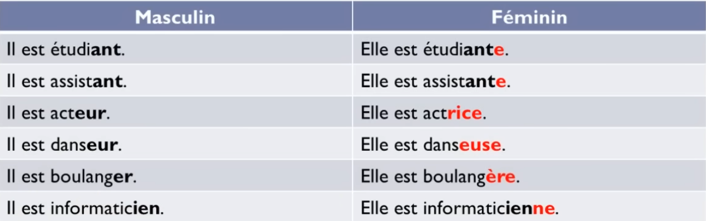

*These notes serve as review material while completing a 30-hour [French course](https://www.youtube.com/playlist?list=PLZNV0gmRjgU-DLcr0EonEcFsg1jnk_Ygr), with the goal of reaching C1/C2 fluency and earning certification through École Polytechnique’s [Coursera course](https://www.coursera.org/learn/comprendre-la-france-advanced-french-language-culture-c1-c2). This is supplimented by the daily practice of vocubalary using [Anki](https://ankiweb.net/shared/info/893324022).*

## Prononciation (pour les maltais)

### Consonnes
$$
\begin{matrix}
&&\\
\textnormal{b: be} & \textnormal{h: axx} & \textnormal{n: enn} & \textnormal{t: te} & \textnormal{cédille}: \textnormal{sedij}
\\
\textnormal{c: se} & \textnormal{j: ġi} & \textnormal{p: pe} &  \textnormal{v: ve} \\
\textnormal{d: de} & \textnormal{k: ka} & \textnormal{q: ku}&  \textnormal{w: double ve} \\
\textnormal{f: ef} & \textnormal{l: ell} & \textnormal{r: er} & \textnormal{x: iks} \\
\textnormal{g: ġe} & \textnormal{m: emm} &  \textnormal{s: es} & \textnormal{z: żed} \\
\end{matrix}
$$

### Voyelles
$$
\begin{matrix}
&&\\
\textnormal{a: a} & \textnormal{e: q twila} & \textnormal{i: i} & \textnormal{o: o} & \textnormal{u: qu / qa} & \textnormal{y: i}
\\
\end{matrix}
$$
$$
\begin{array}{ccccc}
&\textbf{a} & \textbf{e} & \textbf{i} &  \textbf{o} &\textbf{u} & \textbf{n} \\
\hline
\text{a} & \text{} & \text{} & \text{ee} & \text{} & \text{oo} & \text{nasal a}\\
\text{e} & \text{} & \text{} & \text{ee} & \text{} & \text{qeu} & \text{nasal a}\\
\text{i} & \text{} & \text{} & \text{} & \text{} & \text{} &\text{nasal qan}\\
\text{o} & \text{} & \text{} & \text{wa} & \text{} & \text{uu} & \text{nasal qon}\\
\text{u} & \text{} & \text{} & \text{qui} & \text{} & \text{} &\text{nasal qan}\\

\end{array}
$$
listen [here](https://youtu.be/AdfwQXJ0ZVM?list=PLZNV0gmRjgU-DLcr0EonEcFsg1jnk_Ygr&t=4101) for practice

no pronunciation differences for accents on other vowels, except for e:
- è: ee
- é / ê: qe
- ë: ee / qe (variable)

### Liasons

when a word ending in a normally silent consonant e.g. un, is followed by a vowel or h *muet*, that consonant might be transferred onto the next word e.g. un homme - certain consonants change sounds e.g. vous êtes

just because a normally silent consonant is followed by a vowel or mute h, it doesn't automatically mean that a *liaison* must or even can occur - the rules for when and why to pronounce *liaisons* are fairly complicated and have to do with linguistics and register

for further reading, [see here](https://www.lawlessfrench.com/pronunciation/liaisons/)

#### Le h muet

in most cases, h is muted when it's at the beginning of a word, making a *liason* possible and usage of the definite article *l'* in place of *le* or *la* - the aspirated h is a consonant in its own right, so it must be taken into account in the pronunciation, preventing the use of *liason*

:::note
to know if the h of a word is muted or aspired, consult a dictionary - in 'Le Robert', the sign ['] will indicate the presence of an aspired h
:::

### Le pluriel

the plural form has the same pronunciation despite the added s at the end

## Verbes
$$
\begin{array}{c|c|c|}
& \textnormal{être} & \textnormal{avoir} & \textnormal{aller} & \textnormal{faire}\\
\hline
\textnormal{je} & \textnormal{suis} & \textnormal{ai} & \textnormal{vais} & \textnormal{fais}\\
\textnormal{tu} & \textnormal{es} & \textnormal{as} & \textnormal{vas} & \textnormal{fais} \\
\textnormal{il/elle/on} & \textnormal{est} & \textnormal{a} & \textnormal{va} & \textnormal{fait} \\
\textnormal{nous} & \textnormal{sommes} & \textnormal{avos} & \textnormal{allons} & \textnormal{faisons}\\
\textnormal{vous} & \textnormal{êtes} & \textnormal{avez} & \textnormal{allez} & \textnormal{faites} \\
\textnormal{ils/elles} & \textnormal{sont} & \textnormal{ont} & \textnormal{vont} & \textnormal{font} \\
\end{array}
$$

### Verbes pronominaux
$$
\begin{matrix}
\\ & \textnormal{s'appeler} \\
&&\\
\textnormal{je} & \textnormal{m'appelle} \\
\textnormal{tu} & \textnormal{t'appelles}  \\
\textnormal{il/elle/on} & \textnormal{s'appelle}  \\
\textnormal{nous} & \textnormal{nous appelons} \\
\textnormal{vous} & \textnormal{vous appelez } \\
\textnormal{ils/elles} & \textnormal{s'appellent} \\
\end{matrix}
$$
a double l forces the pronunciation of "e" in "ell", while a single l mutes it, as in "lon" and "le" not "elon" and "ele"

## Les articles

$$
\begin{array}{c|c|c|}
\textbf{Indéfinis} & \textbf{Partitifs} & \textbf{Définis} &  \textbf{de + Définis}\\
\hline
\text{un} & \text{du} & \text{le / l'} & \text{du}\\
\text{une} & \text{de la / de l'} & \text{la / l'} & \text{de la}\\
\text{des} & \text{des} & \text{les} & \text{des}\\
\end{array}
$$

an indefinite article becomes *de*:
1. whenever there is an absolute negation:
	e.g. *Il n'y a pas **d'** erreurs dans ce texte.*
	but not when the negation is partial:
	e.g. *Il ne veut pas des crayons rouges **mais** des crayons bleus.*
	or when the verb *être* is present:
	e.g. *Ce ne **sont** pas des amis.*
2. in front of a plural noun preceeded by an adjective
	e.g. *Nous avons fait **de** magnifiques balades.*

the partitive article is used with abstract nouns such as *courage* or non-countable nouns, to express an indefinite quantity:
e.g. *J'ai **bu** du lait.*

similarly, a partitive article becomes *de* whenever there is an absolute negation:
e.g. *J'ai de la chance.* $\rarr$ *Je n'ai pas **de** chance.*
the same exceptions for the indefinite article not converting to *de* apply to the partitive article as well

the definite article is used to refer to a specific person or object, though it can also be used when referring to a set (a specific category):
e.g. ***Le** chien est un animal fidèle.*

### La préposition de

*de* is used without an article in front of:
1. city names indicating an orgin:
	e.g. *Je suis originaire **d'** Italie.*
2. nouns indicating the matter in the literary register:
	e.g. *C'est un sac **de** papier.*
3. nouns indicating content
	e.g. *Un verre **de** vin.*
4. proper nouns
	e.g. *Le sac **de** Sophie.*
5. a common noun that designates a generality
	e.g. *Il faut que j'achète une table **de** jardin.* mais *La table **du** jardin est cassée* since reference to a specific table is being made
6. expressions of quantity
	e.g. *beaucoup de, un peu de, assez de*
7. many French expressions
	e.g. *trembler de froid, avoir une fame de loup*

the partitive article and the indefinite article *des* are omitted after the preposition *de*:
e.g. *Je manque de ~~du~~ sommeil.*
e.g. *J'ai besoin d' ~~l'~~argent.*

### L'article interrogatif

*quel* (masc.) and *quelle* (femm.) are pronounced in the same way, just like their plural form

## Le masculin et le féminin

## Les adjectifs possessifs

choice depends on the word the possessive adjective is connected to:

$$
\begin{array}{c|c|c}
\textbf{Masculin} & \textbf{Féminin} & \textbf{Pluriel}\\
\hline
\text{mon} & \text{ma} & \text{mes}\\
\text{ton} & \text{ta} & \text{tes} \\
\text{son} & \text{sa} & \text{ses} \\
\text{notre} & \text{notre} & \text{nos} \\
\text{votre} & \text{votre} & \text{vos} \\
\text{leur} & \text{leur} & \text{leurs} \\
\end{array}
$$

an exception:
- for feminine words starting with a vowel, like *identité*, use masculine variant: *mon identité*

## Les pronoms toniques

$$
\begin{array}{c|c}
\textnormal{je} &  \textnormal{moi} \\
\textnormal{tu} & \textnormal{toi} \\
\textnormal{il/elle/on} & \textnormal{lui/elle} \\
\textnormal{nous} & \textnormal{nous} \\
\textnormal{vous} & \textnormal{vous} \\
\textnormal{ils/elles} &  \textnormal{eux/elles} \\
\end{array}
$$
personal pronouns are used to construct the sentence subject, whilst tonic pronouns are reserved for emphasis:
e.g. ***Moi**, j'aime le tennis.* (love)
e.g. ***Nous**, nous aimons bien la boxe.* (like)

## Les questions

normally, the subject comes before the verb:
e.g. *Nous arriverons après 18h.*
but the question form shifts the subject towards the end:
e.g. *Quand arrivez-vous?*
unless *est-ce que* (more colloqual) is used:
e.g. *Quand est-ce que vous arrivez?*

$$
\begin{array}{c|c}
\textnormal{quand} &  \textnormal{when} \\
\textnormal{où} & \textnormal{where} \\
\textnormal{pourquoi} & \textnormal{why} \\
\textnormal{comment} & \textnormal{how} \\
\textnormal{combien} & \textnormal{how much} \\
 & \textnormal{how many} \\
\end{array}
$$
## La forme négative

